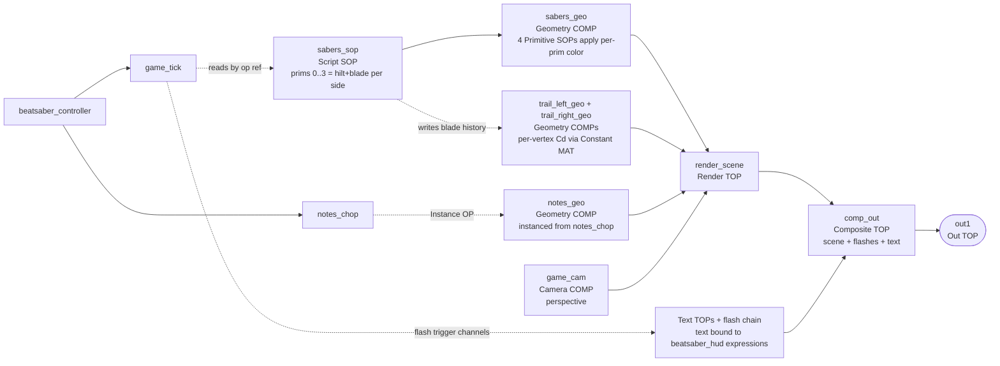

# beatsaber_renderer — setup guide

Dedicated render COMP for the Beat Saber game state. Sibling of
`beatsaber_controller`, consumes its output CHOPs, produces a final TOP.
Independent of the particle renderer.

## What it renders

1. **Sabers** — two 3D lines, one red (left) and one blue (right), from
   hilt to tip, glowing with per-point color via an emissive material.
2. **Notes** — instanced cubes coloured by `color_red` / `color_blue`,
   positioned from `(x, y, z)`, sized by `size`.
3. **UI overlay** — score, combo × multiplier, accuracy %, elapsed time,
   plus full-screen event flashes (green=hit, red=bad cut, white=miss).
4. **Composition** — UI over the 3D render, into a single output TOP.

Optional extras (not wired by the bootstrap — easy to add after):
- Bloom TOP between `render_scene` and `comp_out` for neon glow
- Saber trail: Trail CHOP on the tip channels → CHOP-to-SOP → Line SOP,
  gives visible swept-volume ribbons
- Cut-direction arrow on each note: GLSL material reading `cut_x/y` from
  the note's instance attributes

## Topology



`sabers_sop` reads `game_tick`'s channels directly via an op reference
and maintains the per-side blade history that the trail Geo COMPs read.
`notes_geo` instances from `notes_chop`. The HUD is a stack of Text
TOPs whose `text` parameters call helper functions in `beatsaber_hud`,
plus a Constant-TOP-per-event-kind flash chain whose alpha is bound to
a Lag CHOP envelope of the per-frame trigger channels. No CHOP input
on the renderer — it plumbs via internal references so the renderer
can be relocated or rewired without touching cables.

The camera (`game_cam`) is a purpose-built dedicated game camera —
it is NOT shared with any particle renderer camera or other scene
camera in the project. It exists only inside `beatsaber_renderer` and
its parameters are tied to the game's fixed coordinate convention
(hit plane at `z = 0`, tunnel in `z < 0`, camera at `z > 0`). See the
"Camera" section below for the rationale.

## Quick build — via bootstrap script

1. Drop `bootstrap_beatsaber_renderer.py` into a Text DAT at the
   project root (same level as `bootstrap_velocity_controller.py`).
2. Right-click ▸ **Run Script**. Creates the Base COMP, Text DATs,
   ops, camera, render TOP, UI composite, and output.
3. Follow the 5 manual steps the bootstrap prints to the Textport:
   - Wire `sabers_sop` inside `sabers_geo`
   - Create a material, assign it
   - Set up `notes_geo`'s Instance page
   - Route `notes_chop` → `notes_geo.par.instanceop`
   - Wire `beatsaber_renderer/out1` to your display chain

Full by-hand instructions follow for anyone who prefers manual control
or wants to understand each piece.

## Manual build steps

### 1. Create the COMP and set the controller reference

1. At project root, create a **Base COMP** named `beatsaber_renderer`.
2. Select it. On its parameters page, add a **Custom COMP** par named
   `Controller`. Set its default to `../beatsaber_controller`.

This lets the internal Script ops resolve the controller without hard-
coded paths.

### 2. Add Text DATs

Inside `beatsaber_renderer`, create two Text DATs synced to the
external scripts (same pattern as elsewhere in this project):

| DAT name | File par |
| --- | --- |
| `beatsaber_saber_sop` | `beatsaber_saber_sop.py` |
| `beatsaber_trail_sop` | `beatsaber_trail_sop.py` |
| `beatsaber_hud` | `beatsaber_hud.py` |

Set File + Sync File On + force-reload.

### 3. Sabers — Script SOP + Geometry COMP (with in-COMP color chain)

The Script SOP emits **uncolored** line geometry with stable primitive
numbering: primitive 0 is the left saber, primitive 1 is the right.
Color is applied inside `sabers_geo` via two chained **Primitive SOPs**
that each select by primitive number and apply diffuse color. We do it
this way because TD's Script SOP `Point.Cd` attribute assignment
requires a version-specific `createAttribute()` call that isn't
portable; downstream Primitive SOPs create the `Cd` attribute reliably
on any build.

> **Note:** TD does NOT have a "Color SOP" in its standard op list. The
> right op for per-primitive color is the **Primitive SOP** with its
> "Add" color mode. If you're reading older instructions elsewhere
> that mention "Color SOP", they're wrong.

#### Outside the Geometry COMP

- Create **Script SOP** `sabers_sop` at the `beatsaber_renderer` level,
  Callbacks DAT = `beatsaber_saber_sop`. It takes no inputs — reads
  `game_tick` via the `Controller` par.

#### Inside the Geometry COMP

Enter `sabers_geo` and build this SOP chain left-to-right:

```
in_sabers (In SOP)  →  color_left (Primitive SOP, Group="0", red)  →
color_right (Primitive SOP, Group="1", blue)  →  out_sabers (Out SOP)
```

- **`in_sabers`** (In SOP): exposes the external input. At the COMP
  level outside, wire `sabers_sop → sabers_geo` (TD auto-routes the
  outer cable into the In SOP whose index matches).
- **`color_left`** (**Primitive SOP**):
    - **Group**: `0` (pattern selecting primitive index 0)
    - **Color** page: turn the **Color** toggle ON (also labeled as
      "Do Color" in some builds).
    - **Color Method** (or similar): set to `Add`. This means "replace
      the Cd attribute with this color"; "Keep" leaves existing color
      alone, which we don't want.
    - **Diffuse Color**: `(1.0, 0.25, 0.30)` — red saber.
- **`color_right`** (**Primitive SOP**):
    - **Group**: `1`
    - **Color**: ON, method `Add`.
    - **Diffuse Color**: `(0.25, 0.55, 1.0)` — blue saber.
- **`out_sabers`** (Out SOP): Render flag On, Display flag On. This is
  the SOP that the Geometry COMP renders.

If you can't find the exact parameter names on Primitive SOP (TD
renamed some fields over the years), the core pattern is always:
**Group = primitive number**, **Color toggle on**, **Color mode = Add**,
**RGB = your chosen saber colour**. The UI path varies slightly; the
semantics don't.

#### Material

Create a **Phong MAT** inside `sabers_geo`:

- **Emit Color Source**: `Point Color` — this is the key setting. The
  material reads the per-point `Cd` attribute written by the Color SOPs
  and emits light in that color, so the saber glows in the scene without
  needing any real light source.
- (Optional) Alpha: 1.0, Diffuse: 0.0 if you want pure emissive.

Assign the Phong MAT to `out_sabers`'s Material parameter, OR to
`sabers_geo`'s COMP-level Material parameter (either works — COMP-level
is more convenient for global override).

#### Quick test

With `beatsaber_controller` running, open `sabers_geo`'s Viewer:
- Two short line segments should be visible.
- Left one red, right one blue.
- Both follow your wrist positions, oriented from elbow→wrist with the
  configured Z-extrusion.

If both lines appear the same color, double-check that each Color SOP's
**Group** parameter is `0` or `1` (not empty) and **Group Type** is
`Primitives` (not Points).

### 4. Notes — Geometry COMP with instancing

- Create **Geometry COMP** `notes_geo`.
- Enter `notes_geo`:
    - Delete the default contents.
    - Create a **Box SOP** sized `(1, 1, 1)` (actual size comes from
      the `size` per-instance attribute).
    - Connect to an **In SOP**, Render/Display on.
- Back on the outer `notes_geo`:
    - **Instancing**: On
    - **Instance OP**: `/project1/beatsaber_controller/notes_chop` (or
      whatever path resolves to the controller's notes CHOP)
    - **Translate X**: attribute `x`, multiplier 1, offset 0
    - **Translate Y**: attribute `y`, multiplier 1, offset 0
    - **Translate Z**: attribute `z`, multiplier 1, offset 0
    - **Scale X/Y/Z**: attribute `size`, multiplier 1, offset 0
    - **Color R**: attribute `color_red`
    - **Color G**: attribute `color_blue` multiplied by `0.3` (a touch
      of green on blue notes makes them read better on LCDs; tweak to
      taste)
    - **Color B**: attribute `color_blue`

- Material: another Phong MAT with Emit Color Source = Point Color, or
  a GLSL MAT if you want per-cube behaviour (e.g., rim lighting, cut
  direction arrow from `cut_x/y`).

Test: notes should spawn at `song_time = 2.0s` and visibly animate
toward `z = 0` over the travel_time (default 2s).

### 5. Camera — dedicated game camera

Create a **Camera COMP** named `game_cam` inside `beatsaber_renderer`.
**Do NOT reuse any camera from the particle renderer or elsewhere** —
this camera exists solely to frame the game scene, and its coordinates
are bound to the specific layout the game's Python code uses. Sharing
with another camera would either force one of them into bad numbers,
or make the game renderer's output depend on the particle renderer's
state. Fresh Camera COMP, fresh parameters, no look-at target needed.

#### Coordinate convention (read this before touching params)

The game world uses TD-native camera conventions. Mental model:

| Region | Z value | What's there |
| --- | --- | --- |
| Behind the player | `z > 0` | Camera sits here |
| Hit plane | `z = 0` | Sabers live here; notes pass through |
| Approach tunnel | `z < 0` | Notes spawn at `z_spawn ≈ -10`, travel toward `z = 0` |

A TD Camera COMP with rotation `(0, 0, 0)` looks down its local `-Z`
axis — which, at world position `(0.5, 0.5, +3)`, means looking into
`-Z` world space. The tunnel lies in that direction. No lookAt, no
Y-flip, no axis remapping required. This is why `beatsaber/saber_logic.py`
and `beatsaber/beatmap.py` use **negative** z for the spawn and tunnel:
so the default camera orientation just works.

#### `game_cam` parameters

- **Projection**: `Perspective` (so lanes converge toward a vanishing
  point — that's the Beat Saber "tunnel" look).
- **Translate X / Y / Z**: `0.5 / 0.5 / 3.0`. Center-of-frame in x/y
  matching MediaPipe's (0..1) UV, and `z = +3` puts the camera 3 units
  behind the hit plane.
- **Rotate X / Y / Z**: `0 / 0 / 0`. No look-at target; default
  orientation points into the tunnel naturally.
- **Field of View (Angle)**: `50°`. A bit narrower than typical (60°+)
  because the hit plane fills a `1×1` unit area — tight FOV keeps notes
  big enough to read without extreme near-frustum distortion.
- **Near**: `0.1` (avoids near-plane clipping on sabers, which live at
  `z = 0` to slightly negative).
- **Far**: `20.0` (covers the full note travel range `z = -10 → 0`
  with headroom; clip-far is just past the spawn distance).

#### Why not Orthographic?

Orthographic drops the perspective convergence — notes at `z = -10`
would render exactly the same screen size as notes at `z = 0`, so you'd
lose the approach cue entirely. Perspective is a game-design
requirement, not a stylistic choice, for this genre.

#### Why not look at a target?

You could use a Look At COMP pointer to explicitly aim the camera. For
this setup it's unnecessary — the camera sits directly in front of the
hit plane and looks straight at it. Only reach for Look At if you
later want a moving camera that tracks something (e.g., follow-the-score
camera swoops for polish).

#### Camera verification checklist (do this after setup)

If notes look wrong in the render (flying away instead of approaching,
starting at full size instead of growing, invisible entirely), the
problem is almost always the camera. Verify with the Textport:

```python
cam = op('/project1/beatsaber_renderer/game_cam')
print('tx:', cam.par.tx.eval(),
      'ty:', cam.par.ty.eval(),
      'tz:', cam.par.tz.eval())
print('rx:', cam.par.rx.eval(),
      'ry:', cam.par.ry.eval(),
      'rz:', cam.par.rz.eval())
print('projection:', cam.par.projection.eval())
print('fov:', cam.par.fov.eval())
```

**Expected output** with the current convention:

```
tx: 0.5  ty: 0.5  tz: 3.0
rx: 0    ry: 0    rz: 0
projection: perspective
fov: 50
```

Common misconfigurations and what they cause:

| Problem | Wrong config | Fix |
| --- | --- | --- |
| Notes flying AWAY (shrinking over time) | `tz = -3` (camera on wrong side of hit plane) or `ry = 180` (camera flipped to look +Z) | Set `tz = 3.0`, `rx=ry=rz = 0` |
| Notes invisible entirely | `tz` too small / near plane clipping, OR camera looking wrong direction | `tz = 3.0`, `near = 0.1`, default rotation |
| Notes at full size from the start, don't grow | `projection = orthographic` | Set `projection = perspective` |
| Notes too small / whole scene far away | `fov` too low OR `tz` too large | `fov = 50`, `tz = 3.0` |
| Notes render mirrored (wrong left/right) | `ry = 180` or some other Y-flip | `ry = 0` (the mirrored-webcam input handles the first-person convention) |

If you ran an OLDER version of `bootstrap_beatsaber_renderer.py` before
the z-convention fix, your camera is probably at `tz = -3` and the
notes look wrong. Re-run the current bootstrap, or manually update to
`tz = 3.0`.

### 6. Render TOP

Create `render_scene` Render TOP:

- **Camera**: `game_cam`
- **Geometry**: `sabers_geo notes_geo` (space-separated)
- **Resolution**: `1920 × 1080` (or whatever your target)
- **Anti-alias**: 4x or 8x for clean edges on the lines and cube borders

### 7. HUD overlay — native Text TOPs + flash chain (no PIL)

The HUD is built from TD's standard ops only — no Python image library
required. All numeric readouts are **Text TOPs** whose `text` parameter
is a Python expression calling a helper function in `beatsaber_hud.py`,
and the hit/miss/bad-cut full-screen flashes are **Constant TOPs**
whose alpha is bound to a **Lag CHOP** envelope of the per-frame
trigger channels emitted by `game_tick`.

Sync the helper Text DAT first:

| DAT name | File par |
| --- | --- |
| `beatsaber_hud` | `beatsaber_hud.py` |

Set its **Sync File** = On and Force Reload, same pattern as the other
synced DATs.

#### 7a. Text TOPs (one per HUD element)

Create five Text TOPs at the renderer-COMP level. For each, set
**Resolution** = `1920 × 1080`, background alpha = `0`, font size and
color from the table below, and the `text` parameter as a **Python
expression** (par mode = Python). The expressions all just call
helper functions that read the latest game state from the controller:

| Text TOP | text expression | Font size | Color RGBA | Align | Offset |
| --- | --- | --- | --- | --- | --- |
| `text_score` | `mod('beatsaber_hud').score_text()` | 72 | `(1.0, 1.0, 1.0, 0.9)` | right + top | `(-50, 30)` |
| `text_combo` | `mod('beatsaber_hud').combo_text()` | 48 | `(1.0, 0.86, 0.39, 0.9)` | right + top | `(-50, 120)` |
| `text_accuracy` | `mod('beatsaber_hud').accuracy_text()` | 32 | `(0.71, 0.86, 1.0, 0.78)` | right + top | `(-50, 180)` |
| `text_song_time` | `mod('beatsaber_hud').song_time_text()` | 40 | `(0.78, 0.78, 0.78, 0.86)` | left + top | `(50, 30)` |
| `text_eventlog` | `mod('beatsaber_hud').event_log_text()` | 20 | `(0.85, 0.85, 0.85, 0.9)` | left + top | `(50, 240)` |

The bootstrap creates and configures all five automatically; do this
manually only if you'd rather build the network by hand.

What `event_log_text()` does: it walks the latest game-tick snapshot's
event lists each cook, appends formatted rows to a list stored on the
renderer COMP, trims to the last 22 rows, and returns a multi-line
string with the newest entry on top. Format is
`mm:ss.cc  L|R  KIND  details`. The log auto-clears when `song_time`
jumps backward (game reset / loop wraparound). To force-clear the log
manually, in the textport:

```python
op('/project1/beatsaber_controller/beatsaber_renderer').unstore('beatsaber_eventlog')
```

#### 7b. Hit / bad / miss event flashes

Three Constant TOPs at the renderer-COMP resolution, each with its
alpha bound by expression to the corresponding lag-CHOP envelope of
`game_tick`'s per-frame trigger channels. The lag is fast-attack,
0.3-second-release so a single-cook event blooms instantly to full
strength then linearly fades.

| Op | Type | Settings |
| --- | --- | --- |
| `flash_select` | Select CHOP | **CHOP** = `<controller>/game_tick`. **Channel Names** = `hit_this_frame bad_cut_this_frame miss_this_frame` |
| `flash_lag` | Lag CHOP | Input = `flash_select`. **Lag1** (attack) = `0`, **Lag2** (release) = `0.30` |
| `flash_hit` | Constant TOP | Resolution `1920×1080`. Color `(0.0, 1.0, 0.45)`. Alpha **expression**: `op('flash_lag')['hit_this_frame'][0] * 0.45` |
| `flash_bad` | Constant TOP | Color `(1.0, 0.30, 0.30)`. Alpha **expression**: `op('flash_lag')['bad_cut_this_frame'][0] * 0.60` |
| `flash_miss` | Constant TOP | Color `(1.0, 1.0, 1.0)`. Alpha **expression**: `op('flash_lag')['miss_this_frame'][0] * 0.25` |

Misses are intentionally dim white (least visually disruptive); bad
cuts are bright red (forcing your attention to the mistake); good hits
are subtle green (positive feedback without occluding the playfield).
Multiplier per kind is the per-flash maximum opacity — tune to taste.

### 8. Compose HUD over scene

`comp_out` is a Composite TOP with **Operand** = `over` and many
inputs in stacking order. Later inputs render on top of earlier ones,
so:

| Input | Source |
| --- | --- |
| 0 | `render_scene` (the 3D game) |
| 1 | `flash_miss` |
| 2 | `flash_bad` |
| 3 | `flash_hit` |
| 4 | `text_eventlog` |
| 5 | `text_song_time` |
| 6 | `text_accuracy` |
| 7 | `text_combo` |
| 8 | `text_score` |

Wire these inputs in order on `comp_out`. The scene goes first; the
flash tints layer over the scene; the text HUD renders on top of the
flashes. The bootstrap auto-wires this stack.

#### Why the HUD is built from native ops

- **No external dependency.** Text TOPs use TD's bundled font
  rasterization — nothing to `pip install`.
- **Live tunability.** Font, size, color, alignment, position are all
  parameters on the Text TOP — tweak in the param panel, see the
  change immediately.
- **Inspectable in the network.** Each HUD element is a separate node
  you can preview by middle-clicking.
- **Composable.** The flash chain pipes into the same Composite TOP
  as the text TOPs, ordered by index — easy to insert a Bloom TOP
  before the Constants for an extra glow, or a Level TOP between
  inputs for per-layer brightness, etc.

### 9. Output

Create `out1` Out TOP, wire `comp_out → out1`.

### 10. Test

Drop a Null TOP outside the COMP, connect `beatsaber_renderer/out1`
into it, open its Viewer. You should see:
- Dark scene with two glowing red/blue saber lines following your hands
- Notes spawning at 2.0s, cubes approaching camera
- Score 0, combo 0, accuracy 0% in the top-right
- Event flashes when you hit/miss/bad-cut

## Adding polish

Easy upgrades that significantly improve readability:

### Bloom for neon feel

Insert a **Bloom TOP** between `render_scene` and `comp_out`. Defaults
are OK; crank Strength to ~2 and Levels to 8 for a heavy neon bloom.

### Saber swept-volume trails

- **Trail CHOP** on `game_tick`'s output, Channel Names: `left_tip_*
  right_tip_*`, Window Length = `parent().par.Trailframes` (on
  beatsaber_controller).
- **CHOP to SOP** in `Channels Are Points` mode on the Trail CHOP
  output. One SOP with two sub-polylines.
- Add to `sabers_geo`'s inner graph, colored like the sabers but fading
  with age via a Color SOP whose alpha ramps from 1.0 at front (recent)
  to 0.0 at tail (oldest).

### Cut-direction arrows on notes

Add a custom GLSL MAT on `notes_geo`. In the fragment shader, read the
instance's `cut_x`, `cut_y` attributes (exposed via `TDInstanceCustom…`
uniforms), and draw a small arrow on the face pointing toward the
camera. The arrow's rotation comes from `atan2(cut_y, cut_x)`. The
setup guide for this is beyond scope of this doc but the signal is
already on the `notes_chop`.

### Music playback

Add an **Audio File In TOP** (or CHOP — TD has both, use the TOP path
for volume control in the current pipeline). Its time is what you'd
bind `timeline.song_time()` to when moving beyond the test clock. Hook:

```python
# In beatsaber_game_tick.py, replace `absTime.seconds` with:
audio_op = op('/project1/audio_file_in')   # or however you reach yours
audio_time = audio_op.par.timeindex.eval() if audio_op else absTime.seconds
events, snapshot = game.tick(audio_time, samples)
```

Then start / pause logic on the Audio File In mirrors the game's
timeline state.

## Parameters rundown

Custom pars on `beatsaber_renderer`:

| Par | Page | Default | Role |
| --- | --- | --- | --- |
| `Controller` | Renderer | `../beatsaber_controller` | COMP pointer used by the Script ops to resolve the controller's `game_tick` CHOP and `notes_chop`. |
| `Worldscale` | Renderer | `2.5` | Uniform scale applied to both `sabers_geo` and `notes_geo` (Sx & Sy, pivoted at world `(0.5, 0.5, 0)`). The MediaPipe-UV (0..1) world is small relative to the camera's visible region (FOV 50° at distance 3 sees a ~5×2.8 unit window), so the sabres' 1×1 reach would only cover ~20% of screen width without scaling. 2.5× brings reach to ~50% of width and ~90% of height; 3.0 ≈ full width. The scale also enlarges sabre and note GEOMETRY proportionally, which is what you want — bigger reach AND bigger visible sabres. Game logic still operates in unscaled (0..1) coords, so collision detection, beatmap files, and scoring are unaffected. |

### Trail material requirements

Each trail Geo COMP is rendered through its own **Constant MAT**
(`mat_trail_left`, `mat_trail_right`). The MATs are identity
multipliers — they pass per-vertex Cd through unchanged. Per-side
tinting and per-segment age-fade alpha both come from the geometry,
written by the Script SOP via `point.color = (r, g, b, alpha)`.

For this to render correctly, each trail Constant MAT needs:

1. **Color** RGBA = `(1.0, 1.0, 1.0, 1.0)` (identity multiplier).
2. **Use Point Color** (or "Color Source = Point Color" depending on
   TD build) = **ON**.
3. **Transparency / Blending** = **ON**.

The bootstrap sets all three. If trails render flat white, the MAT's
"Use Point Color" toggle didn't take — set it manually on each MAT
and (separately) report the actual TD par name so the bootstrap can
hardcode it instead of probing.

If you want the renderer to work with a non-sibling controller (e.g.,
testing two simultaneous games on different COMPs), point `Controller`
elsewhere and the internal ops follow.

## Separating from the particle renderer

This renderer is entirely independent of the particle pipeline — it
doesn't touch any of velocity_controller, emitters_tex, particle_pop,
etc. You can:

- Run only particles (don't build `beatsaber_renderer`)
- Run only the game (build both beatsaber COMPs, disable the particle
  render tree)
- Run both simultaneously — each produces its own Out TOP; composite
  them downstream with a Composite TOP (over, screen, or add depending
  on the mood you want)

For the eventual "particles reactive to cuts" feature, the hook point
is `beatsaber_controller/game_tick`'s `hit_this_frame` / event channels
— feed those into a particle burst trigger without touching either
renderer.

## Troubleshooting

- **`AttributeError: 'td.Point' object has no attribute 'Cd'`** in
  `beatsaber_saber_sop`: you have an older version of the callback
  that tried to set per-point colour directly. The current version
  doesn't — colour is applied via downstream Color SOPs. Force-reload
  the `beatsaber_saber_sop` DAT to pick up the latest script.

- **Sabers not visible**: the `sabers_sop` Script SOP probably isn't
  wired to `sabers_geo`. At the COMP level, drag `sabers_sop`'s output
  onto `sabers_geo`'s input (the outer cable auto-routes to `in_sabers`
  inside). Also check that `game_tick` on the controller side is
  actually producing channels (look at its Info popup — it should have
  `left_hilt_x`, `right_tip_y`, etc.).

- **Both sabers the same colour / colour not applied**: one of the
  Primitive SOPs isn't doing its job. Check `color_left` and
  `color_right` inside `sabers_geo`:
    - Group = `0` (for left) or `1` (for right)
    - The Color toggle / "Do Color" is ON
    - Color Method = `Add` (not `Keep`)
    - Diffuse Color RGB values are what you expect
  If you're looking for "Color SOP" — that doesn't exist in TD; it's
  Primitive SOP.

- **Notes don't render**: check `notes_geo`'s Instance OP points at
  `beatsaber_controller/notes_chop`, and that attribute names on the
  Instance page match the channels the notes_chop emits (`x`, `y`, `z`,
  `size`, `color_red`, `color_blue`, etc.). Run the controller until
  `song_time > 2.0s` so a note actually spawns.

- **Everything black**: no light in the scene, but we rely on emissive
  (Emit Color Source = Point Color). Double-check the material is
  using that setting, not trying to do Phong lighting against no
  light source.

- **HUD text blank or missing**: the new HUD is built from native
  Text TOPs whose `text` parameter binds to expressions like
  `mod('beatsaber_hud').score_text()`. If text is empty:
  (a) verify the `beatsaber_hud` Text DAT exists in the renderer
  COMP and points at `beatsaber_hud.py` with Sync File ON (Force
  Reload it), (b) verify the renderer COMP's `Controller` par
  resolves to your `beatsaber_controller`, (c) middle-click each
  Text TOP to confirm its `text` parameter actually evaluates
  (the Info popup shows the current text). If the value reads
  `None` or `""`, the Controller par or the channel name is wrong.

- **Camera wrong zoom / FOV**: Camera COMP's Ortho Width doesn't apply
  to perspective cameras. Use **FOV** (Field of View angle) to zoom —
  lower value = narrower / more zoomed in, higher = wider.

- **Notes not visible / camera looking the wrong way**: make sure
  `game_cam` is at **positive z** (e.g. `tz = 3.0`) with rotation
  `(0, 0, 0)`. TD cameras default to looking down their local -Z; with
  the camera at +Z and the tunnel at -Z, this is natural. If you
  accidentally set the camera at negative Z (mimicking some other
  scenes in the project), it'll face away from the notes. The
  bootstrap script uses `tz = 3.0` specifically to avoid this.

- **Sabers visible but notes missing or "inside out"**: mismatch
  between the `z_spawn` in your beatmap and the camera's near/far
  planes. Check `test_beatmap.json` has `"z_spawn": -10.0` (negative)
  and camera `Far = 20` or greater. If you get the sign wrong on
  `z_spawn`, notes spawn behind the camera.
