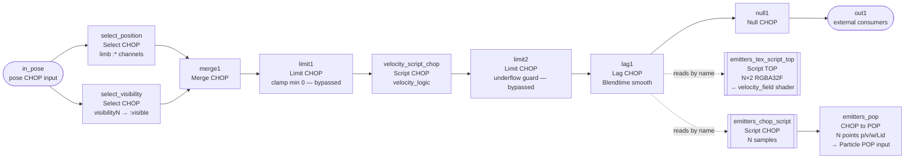
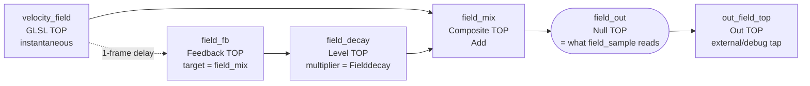
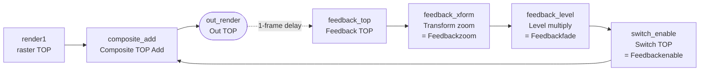

# velocity_controller — setup guide

Companion to `painting_controller`, same conventions (parent-pars-only, pure-Python
logic module, Lag CHOP does the smoothing, Select CHOP chooses landmarks upstream).
**Everything lives inside a single `velocity_controller` Base COMP** — sensing
chain and rendering chain are siblings inside the same COMP so every GLSL uniform,
emitter spawn rates, Feedback TOP fade, etc. can read their parameters locally as
`parent().par.*` with no custom COMP pointers. Targets TD **2025.30960+**.

## TL;DR of what this ships

A single `velocity_controller` Base COMP with two sub-chains:

- **Sensing** — reads 5 MediaPipe landmarks, emits per-limb
  `x/y/vx/vy/speed/accel/emit/burst/visible` plus `total_motion/total_burst/frame_dt`
  on `out1` (for any external consumer) AND feeds the renderer directly via the
  internal `lag1` CHOP.
- **Rendering** — reads `lag1` by channel name through two small Script ops
  (Script TOP + Script CHOP) that fan it out into a texture and a reshaped
  CHOP. The texture feeds a GLSL TOP velocity field; the CHOP feeds a
  stock CHOP-to-POP converter that seeds the POP spawn+advect chain. Final
  output is a TOP.

## Input contract (into the `velocity_controller` Base COMP)

One CHOP input carrying normalized MediaPipe pose channels. After the upstream
Select CHOP narrows to this experiment's landmarks, you should have, for each of
the five default landmarks, at minimum:

```
left_wrist:x   left_wrist:y   [left_wrist:z]    [left_wrist:visible]
right_wrist:x  right_wrist:y  [right_wrist:z]   [right_wrist:visible]
left_ankle:x   left_ankle:y   [left_ankle:z]    [left_ankle:visible]
right_ankle:x  right_ankle:y  [right_ankle:z]   [right_ankle:visible]
nose:x         nose:y         [nose:z]          [nose:visible]
```

`:z` is MediaPipe's depth estimate — same rough unit scale as x, hip-center
at 0, negative = toward camera, positive = away. Optional (missing → 0,
pipeline falls back to 2D behavior). Less reliable than x/y since it's
monocular depth, but usable for forward/back motion detection.

`:visible` is MediaPipe's 0..1 confidence score; anything below
`Visibilitythreshold` is treated as off-frame. If the channel isn't
present the landmark is assumed fully visible.

The exact landmark set is configurable via the `Landmarks` parent par (space or
comma separated); the Script CHOP rebuilds its state dict on change.

## Output contract (from the `velocity_controller` Base COMP)

Pre-Lag channels from the Script CHOP, in emission order:

Per landmark `<L>`:
- `<L>:x`, `<L>:y`, `<L>:z` — pass-through position (3D; z in MediaPipe depth units)
- `<L>:vx`, `<L>:vy`, `<L>:vz` — smoothed velocity (1/s in MediaPipe-space)
- `<L>:speed` — 3D magnitude sqrt(vx²+vy²+vz²)
- `<L>:accel` — smoothed |a| (3D)
- `<L>:emit` — 0..1 emission rate (`speed / Speedscale`, clamped)
- `<L>:burst` — 0..1 burst envelope (`|a|` spike above threshold, decays)
- `<L>:visible` — 0 or 1

Globals:
- `total_motion` — sum of per-limb speed
- `total_burst` — sum of per-limb burst
- `frame_dt` — observed seconds between cooks (diagnostic; don't drive visuals with it)

Post-Lag (the Base COMP's actual output CHOP), these are all smoothed by a single
Lag CHOP whose `Lag 1` and `Lag 2` both reference `parent().par.Blendtime`. Keep
Blendtime short (0.05–0.15s) — we already smooth upstream, this is just to remove
frame-to-frame jitter for the renderer.

**Position-hold on dropout (hysteresis).** Confidence from MediaPipe
typically degrades *gradually* as a limb leaves the frame — position
becomes garbage several frames before confidence drops below any single
threshold. To handle that cleanly, the sensing side uses **two
thresholds**:

- `Visibilitythreshold` (default 0.5) — the *output gate*. Below this,
  `<L>:visible` emits 0 and emit/burst envelopes fade out.
- `Trustthreshold` (default 0.75) — the *commit threshold*. Only frames
  at or above this confidence update the cached "last good" position and
  run the velocity math.

That gives three behavioral zones on `:visible`:

| MediaPipe confidence | Zone | Output position | Output `visible` |
| --- | --- | --- | --- |
| ≥ Trustthreshold | Trusted | raw `x, y` | 1 |
| Visibilitythreshold..Trustthreshold | Marginal | last-good (frozen) | 1 |
| < Visibilitythreshold | Invisible | last-good (held) | 0 |

The key win is the marginal zone: the emitter stays on for spawning but
is pinned to the last genuinely-trusted position, so it doesn't slide
toward garbage during the confidence ramp-down. By the time `:visible`
goes to 0, position is already at the correct last-good — lag1 sees no
change in position, and the blob fades in place instead of sliding.

`Maxjump` is a secondary safeguard: within a *continuous* trusted stream,
any single-frame position jump larger than `Maxjump` UV units demotes the
frame to the marginal zone (output last-good, don't commit). The check
runs against the previous *frame's* position, not the cached last-good,
so after any dropout / marginal period it's naturally skipped —
re-acquisition always accepts the new position, even if the joint
reappears on the opposite side of the frame. (Without that, a joint that
leaves on the right and returns on the left would get stuck at the old
right-side cached position forever, because every re-acquisition frame
exceeds `Maxjump`.) Tune `Maxjump` against your expected fastest
legitimate motion: at 60 fps a very fast whip is ~0.05 UV/frame, so
0.2–0.3 is a safe ceiling. Set to 0 to disable.

`Settleframes` (default 5) is a third safeguard layered on top of
`Maxjump`. For the first N trusted frames after any dropout, the
`Maxjump` check is suspended. MediaPipe's first trusted frame on
re-acquisition often lands near the re-entry edge before locking onto the
real joint position a frame or two later — without the grace, that second
frame gets rejected as a teleport (it's > `Maxjump` from the edge `prev_x`)
and the blob would be stuck at the re-entry edge for a cook. During the
grace window we simply accept whatever MediaPipe sends; normal teleport
protection resumes once the tracker has had `Settleframes` cooks to lock
on. If you still see your blob briefly snap from the edge inward after
reappearance, raise `Trustthreshold` toward 0.85–0.9 — that's MediaPipe's
own edge-lock noise, which only a higher confidence threshold can filter
out at the source.

**3D / z-axis behaviour.** The pipeline tracks MediaPipe's z alongside x/y
end-to-end. `<L>:z` and `<L>:vz` appear in the output CHOP; 3D speed
(`sqrt(vx²+vy²+vz²)`) drives `emit` so forward/back motions contribute to
particle emission the same as side-to-side; 3D acceleration magnitude drives
`burst` so a sudden forward thrust triggers a puff. On the renderer side:

- `emitters_chop_script` emits `P2=z` and `v2=vz`, so particles get launched
  with 3D initial velocity and the POP integrates motion on all
  three axes — particles really do get flung forward or back.
- `emitters_tex_script_top` packs z into row 0 and vz into row 1.
- The velocity-field shader uses the per-limb z to scale each emitter's
  splat size (closer to camera = bigger splat; `uZGain` controls
  strength), and outputs RGB = full 3D velocity so the Force POP pushes
  particles on all three axes.
- The shader also elongates the gaussian kernel along the limb's velocity
  direction (`uVelStretch`). A limb moving fast throws a longer "cone" of
  force ahead of itself, so particles in the direction of motion get
  shoved further than those to the side. That's what gives the "flung"
  feel beyond what round kernels alone would produce.

If your input pose CHOP doesn't carry `:z` channels (some wrappers strip
it), the pipeline falls back to z=0 everywhere — you get the same 2D
behavior as before, no visual change. You can mix: some landmarks with z,
some without.

**Tuning depth sensitivity.** By default, z-axis motion contributes less
to emit rate and burst detection than x/y motion does — controlled by
the `Zspeedweight` parameter (Sensing page, default `0.35`). Rationale:
MediaPipe's z is noisier than x/y, and leaning forward shouldn't produce
the same emission spike as a full arm whip. The weight multiplies `vz`
before it enters the speed/accel magnitude calculations, so at 0.35 a
pure-depth motion produces ≈35% the emit/burst response of the same raw
motion in-plane. `vz` itself is still emitted as an output channel at
full fidelity for the renderer to use — the weight only tames *sensing*
sensitivity, not *output* accuracy.

If depth motion still feels over-reactive (very close performer, noisy
tracker, etc.), drop `Zspeedweight` toward 0.1–0.2. Set it to 0 to make
depth motion completely inert for emit/burst while still letting vz push
particles in the z direction via the velocity field. Crank it up to 1.0
if you specifically want "lean-in = explosive burst" behaviour.

**Two separate z-axis tamers — know which one to reach for:**

| Par | Layer | What it controls | Lower if you see… |
| --- | --- | --- | --- |
| `Zspeedweight` | Sensing | How much `vz` contributes to `speed` & `accel` magnitudes → emit rate & burst triggering | Too many particles spawn when you lean in or out |
| `Zforceweight` | Renderer | Scales `vz` on both the flowfield (force on live particles) AND `StartPartvel.z` (launch velocity of newborns) | Particles drift forward/back during pure horizontal motion |

MediaPipe's monocular depth estimate is noisy even during pure xy
motion — hand pose changes cause spurious vz readings of several UV/s
as the learned depth model wobbles. `Zforceweight = 0.05` knocks that
down to ~5% on both render paths, which makes z-motion essentially
disappear from the particle visual unless the performer deliberately
leans in or out at significant speed. Set to `0` if you want the
pipeline to behave as purely 2D on the render side regardless of what
MediaPipe reports for z.

On the renderer side, the splat-size-from-z formula is also tightened
against close-up blowup: `size_mult = clamp(1.0 - z * Zgain, 0.25, 1.8)`.
Very-close limbs (large negative z) get capped at 1.8× the base radius
rather than the 3× they could hit previously. `Zgain` default lowered to
0.35 so size variation from depth is noticeable but subtle. `Fieldradius`
default also lowered to 0.09 so the base blob is tighter — both together
should keep close-up limbs from dominating the frame.

**NaN/Inf resilience.** MediaPipe occasionally emits non-finite position
or confidence values (first cook of an invisible landmark, tracker
restart, certain tox builds mid-dropout). The Script CHOP scrubs all
input channels with `math.isfinite` before the logic sees them, the logic
scrubs stored state on every cook, and `_emit` guards every outbound
channel. End result: NaN can never reach the Lag CHOP, and any
corruption that somehow does land in state heals on the next cook. If
you previously had to manually reset the Lag CHOP to clear stuck
accel/burst values, that should no longer happen.

**Tuning hierarchy if you still see a teleport:** raise `Trustthreshold`
first (0.8–0.9 is common for jittery MediaPipe output); then tighten
`Maxjump` toward 0.15. Don't raise `Visibilitythreshold` unless the joint
lingers as a fading blob for too long after it actually leaves frame —
that's what it's for.

## Inside the `velocity_controller` Base COMP

One COMP, three sub-chains: a sensing CHOP chain, a POP particle sim, and a
screen-space feedback loop on top. The diagrams below split them apart for
legibility; in the COMP itself they're all peers.

### As-built op names (live network is source of truth)

This guide was originally written against idealized names (`in1`, `select1`,
`script1`, `particle_pop`, `render_top`). The live COMP uses the names below —
they're what's documented from here on:

| Role | Live op | Notes |
| --- | --- | --- |
| Pose input | `in_pose` (In CHOP) | Time Slice On; carries all 33 MediaPipe landmarks |
| Position select | `select_position` (Select CHOP) | pattern `left_wrist:* right_wrist:* left_ankle:* right_ankle:* nose:*` |
| Visibility select | `select_visibility` (Select CHOP) | picks `visibility0/15/16/27/28`, **renames** to `<lm>:visible` |
| Merge | `merge1` (Merge CHOP) | joins position + visibility |
| Guards | `limit1`, `limit2` (Limit CHOP) | currently **bypassed** clamp/underflow safety |
| Velocity logic | `velocity_script_chop` (Script CHOP) | callbacks DAT `velocity_script_cb` |
| Smooth | `lag1` (Lag CHOP) | Lag 1 / Lag 2 = `parent().par.Blendtime` |
| Output | `null1` → `out1` | external consumers |
| Field texture | `emitters_tex_script_top` (Script TOP) | callbacks `emitters_tex_script_cb` |
| Emitter points | `emitters_chop_script` (Script CHOP) | callbacks `emitters_chop_script_cb` |
| → POP | `emitters_pop` (CHOP to POP) | attrs `p / v / w / Lid` |
| Ambient soup | `ambient_chop_script` (Script CHOP) → `ambient_pop` (CHOP to POP) | constant soup, `Lid`=5 sentinel; callbacks `ambient_chop_script_cb` |
| Emitter merge | `merge_emitters` (Merge POP) | movement `emitters_pop` + soup `ambient_pop` → particle1 |
| Particle sim | `particle1` (Particle POP) | hub op |
| P→UV | `p_to_uv` (GLSL POP) | writes `Puv` for field lookup |
| Field sample | `field_sample` (Lookup Texture POP) | reads `field_out`, indexes by `Puv` |
| Curl drift | `curl_noise` (Noise POP) | |
| Force sum | `add_to_force` (Math/Mix POP) | → `Partforce` |
| Integrate+contain | `bounds_reflect` (GLSL POP) | force integration + damping + wall reflect |
| Feedback target | `force_null` (Null POP) | `particle1.Target Particles Update POP` |
| Color | `color_attr` (GLSL POP) | writes `Cd` (per-limb palette + velocity accent) |
| Render source | `render_null` (Null POP) | instance source for `geo1` |
| Instancer | `geo1` (Geometry COMP) | child `sphere1`, material `particle_phong` |
| Lights | `key_light`, `fill_light` (Light COMP) | `particle_phong` is lit, not constant |
| Camera | `particle_cam` (Camera COMP) | |
| Raster | `render1` (Render TOP, 1280×720, **RGBA 16-bit float**) | → `bloom1` |
| Bloom | `bloom1` (Bloom TOP) | HDR glow; `render1` → `bloom1` → `null2` → `out2` |
| Bounds viz | `bounds_geo` + `bounds_mat` | visible wire box at the containment bounds |

### Sensing chain + fan-out



Both emitter Script ops pull from `op('lag1')` by channel name — no
Select/Shuffle/Rename between them and the Lag CHOP.

Why two selects + a merge: the upstream MediaPipe tox emits position channels
named `<lm>:x/y/z` but visibility as indexed `visibility<N>` channels.
`select_position` grabs the `<lm>:*` set; `select_visibility` grabs
`visibility0 visibility15 visibility16 visibility27 visibility28` and renames
them to `nose:visible left_wrist:visible right_wrist:visible left_ankle:visible
right_ankle:visible`. `merge1` recombines them into the `<lm>:x/y/z/visible`
contract the Script CHOP expects.

`limit1` (clamp min 0) and `limit2` (underflow guard) are safety CHOPs that are
**currently bypassed** — they're inert unless re-enabled. `null1` is a fan-out
buffer before `out1`.

Text/Callback DATs:
- `velocity_logic` — synced to `velocity_logic.py`
- `velocity_script_cb` — synced to `velocity_script_chop.py`, callbacks of `velocity_script_chop`
- `install_velocity_params` / `reset_velocity_params` — run once via right-click ▸ Run Script
- `emitters_tex_script_cb` — synced to `emitters_tex_script.py`, callbacks of `emitters_tex_script_top`
- `emitters_chop_script_cb` — synced to `emitters_chop_script.py`, callbacks of `emitters_chop_script`

Parent pars installed onto two pages:
- **Sensing**: `Landmarks`, `Visibilitythreshold`, `Trustthreshold`, `Velocitysmooth`,
  `Accelsmooth`, `Speedscale`, `Accelthreshold`, `Accelscale`, `Burstdecay`,
  `Maxjump`, `Settleframes`, `Zspeedweight`, `Blendtime`.
- **Renderer**: `Spawnrate`, `Burstgain`, `Spawncount`, `Spawnspread`,
  `Spawnspreadref`, `Spawnspreadmin`, `Spawnperpratio`, `Spawnvelscale`,
  `Spawnvelfan`, `Fieldradius`, `Fieldforce`, `Fielddecay`,
  `Forcescale`, `Velocitydamping`, `Maxspeed`, `Forcedeadzone`,
  `Forceref`, `Forcegamma`, `Zgain`,
  `Zforceweight`, `Velstretch`, `Stretchspeedref`, `Curlgain`,
  `Curlscale`, `Lifemin`, `Lifemax`, `Boundsminx`, `Boundsminy`,
  `Boundsminz`, `Boundsmaxx`, `Boundsmaxy`, `Boundsmaxz`,
  `Boundsbounce`, `Boundsmargin`, `Feedbackenable`, `Feedbackfade`,
  `Feedbackzoom`.
  (`Forcescale … Forcegamma` are the `bounds_reflect` force-integration
  uniforms; `Feedback*` are reserved — no smear chain is wired today.)

The page split is purely organisational — both pages live on the same COMP, and
every renderer op reads its pars via `parent().par.*` because `parent()` inside
any op is `velocity_controller`. Sensing tuning doesn't disturb rendering and
vice versa, even though they share a COMP.

## Renderer sub-chain (inside `velocity_controller`)

The render side reads from the sensing-side `lag1` CHOP via two small Python
operators. No Shuffle/Rename/Select fan-out — both scripts look up channels by
name (`left_wrist:x`, etc.) so they don't care about channel order.

### 1. `emitters_tex_script_top` — Script TOP

Feeds the velocity-field shader. Produces an **`N × 2` RGBA32F** texture:

- **Width `N`**: the landmark count — derived dynamically from
  `parent().par.Landmarks` inside the Script TOP's callback (same source
  of truth as every other op in the pipeline). If you change the
  `Landmarks` par, the texture resizes on the next cook automatically
  (`copyNumpyArray` sets the TOP's shape from the numpy buffer). You don't
  need to hardcode N anywhere — the Output Resolution field on the Script
  TOP is just an initial hint to avoid a one-frame black flash at startup;
  the runtime size tracks the landmark count. Set it to `5 × 2` for the
  default landmark set, or just leave it at defaults — the callback will
  resize on first cook.
- **Height `2`**: because we pack **8 floats per landmark** into an RGBA
  texture (4 floats per texel), so 8 / 4 = 2 texels per column. The
  layout:
    - Row 0: `(x, y, z, visible)` — 3D position + visibility gate
    - Row 1: `(vx, vy, vz, force_gain)` — 3D velocity + pre-combined
      `(emit + Burstgain * burst) * visible` weight

  Why 8 floats? We need `x, y, z` (3), `vx, vy, vz` (3), `visible` (1) and
  `force_gain` (1) in the shader to do everything it does. Any fewer and
  we lose a capability (drop z → no depth scaling; drop visible → no
  dropout gating; drop force_gain → back to separate emit/burst uniforms).
  8 floats is the minimum for the current feature set, hence 2 rows.

  If you want to extend the shader with more per-landmark data later
  (per-limb color hint, per-limb custom scale, etc.), you'd bump this to
  3 rows = 12 floats per landmark and teach the shader to sample the
  extra row.

Setup:

1. Inside `velocity_controller`, create a **Text DAT** named
   `emitters_tex_script_cb`, synced to `emitters_tex_script.py`.
2. Create a **Script TOP** named `emitters_tex_script_top`. No inputs — it
   reads `op('lag1')` by name from inside its callback.
3. Set its Callbacks DAT to `emitters_tex_script_cb`.
4. Set Output Resolution to Custom, e.g. `5 × 2` (matches default landmark
   count). The callback also calls `copyNumpyArray` with the correct shape,
   so TD resizes automatically on cook — but setting it explicitly avoids a
   one-frame black flash on startup.

### 2. `velocity_field` — GLSL TOP (+ external persistence chain)

Samples `emitters_tex_script_top`, splats gaussians, outputs the **instantaneous**
advection field. Persistence (force trails lingering in the air) lives
outside the shader so it compiles with a single input and is tuneable
without recompile.

**GLSL TOP itself:**

- **Pixel Shader**: `velocity_field.frag` (load via the GLSL TOP's `Pixel
  Shader` par pointing at the file on disk, or paste into a Text DAT and
  reference that).
- **Resolution**: `256 × 256`, Format `RGBA 16-bit float`.
- **Input 0**: `emitters_tex_script_top`. **No other inputs** — the shader
  declares `sTD2DInputs[0]` only; wiring an input 1 is neither needed nor valid.
- **Vectors 1 uniforms** (all expressions, reading `parent().par.*`):

| Uniform | Expression |
| --- | --- |
| `uNumEmitters` | `len(parent().par.Landmarks.eval().replace(',', ' ').split())` |
| `uRadius` | `parent().par.Fieldradius` |
| `uForceGain` | `parent().par.Fieldforce` |
| `uZGain` | `parent().par.Zgain` |
| `uVelStretch` | `parent().par.Velstretch` |
| `uStretchSpeedRef` | `parent().par.Stretchspeedref` |
| `uZForceWeight` | `parent().par.Zforceweight` |

`uZForceWeight` damps the z component of the splatted velocity (MediaPipe
depth noise → spurious vz); matches the spawn-side `Zforceweight` knob.

The shader's `force_gain` input already bakes in `Burstgain` on the Python
side (`emitters_tex_script.py` computes `(emit + Burstgain*burst) * visible`
into the texture's row-1 alpha channel), so the shader no longer needs a
separate `uBurstGain` uniform.

**External persistence chain** (follows the GLSL TOP, output of the chain is
what the Force POP samples):



`field_decay`'s RGB Multiplier = `parent().par.Fielddecay`. At 0 the field
snaps every frame, at 0.9 it trails for about a second. `field_sample`
(Lookup Texture POP) points at `field_out` so it reads the persistent field,
not the instantaneous one. `field_fb`'s reset is bound to `keyboardin1` chan
`k1` so a keypress flushes the trail. `out_field_top` is an external/debug tap.

> **Heads up:** `field_sample` does **not** index the field by raw `P` — a
> `p_to_uv` GLSL POP runs first and writes a `Puv` attribute (P remapped into
> the box's `[0,1]²` UV with aspect correction), and `field_sample` uses `Puv`
> as its lookup index. See the POP chain below.

### 3. `emitters_chop_script` (Script CHOP) → `emitters_pop` (CHOP to POP)

Two-op chain. TD has no Script POP, so we stage the work in CHOP-land (where
Script CHOP has always been reliable) and hand off to a native CHOP-to-POP
converter for the final conversion. Script CHOP reshapes `lag1`'s
1-sample-many-channels output into an N-sample-few-channels shape with
attribute-style channel names; CHOP-to-POP then reads those channels into
the vec3 / scalar point attributes the downstream emission POP needs as
its emitter input.

**`emitters_chop_script` — Script CHOP:**

- Callbacks DAT `emitters_chop_script_cb`, synced to `emitters_chop_script.py`.
- Create a **Script CHOP** named `emitters_chop_script`, Callbacks DAT =
  `emitters_chop_script_cb`. No inputs — it reads `op('lag1')` by name from
  inside the callback.

Output CHOP has N samples and these channels (per landmark, one sample
each). **Note:** TD doesn't allow `[` or `]` in channel names (it silently
replaces them with `_`), so we use bare numbered suffixes and wire up
vec3 grouping explicitly on the CHOP-to-POP.

| Channel | Meaning |
| --- | --- |
| `P0`, `P1`, `P2` | Point position (x, y, z) |
| `v0`, `v1`, `v2` | Initial velocity handed to new particles (3D) |
| `w` | Spawn weight = `(emit + Burstgain * burst) * visible` |
| `id` | Landmark index, for per-limb color (lands on the POP as `Lid`) |

Drop a Trail CHOP on `emitters_chop_script` while debugging — you should see
5 samples, each tracking the matching landmark's live position/velocity.

**`emitters_pop` — CHOP to POP:**

- Create a **CHOP to POP** op named `emitters_pop`, plug `emitters_chop_script`
  into its CHOP input.
- Configure the parameters page (this is the part that needs to be
  explicit — CHOP-to-POP doesn't auto-group our channels without help):

    - **Connectivity**: `Points`. (Default is "Line Strip" which draws
      lines between consecutive samples — that's where the lines you see
      running through the emitter points are coming from. We want
      isolated points.)
    - **Specify Position**: `Off`. (Leaving it on generates extra points
      along a line; we want points directly from the CHOP samples.)
    - **Channels Selection**: `Specify Channels` (or whatever mode lets
      you define attribute rows).
    - **Channel Scope**: `*` (consider all channels from the CHOP).

- Add **four attribute rows** under the "New Attribute" section (use
  the `+` button to add rows):

    | Row | Attribute Name | Type / Size | Channel Scope | Default Value |
    | --- | --- | --- | --- | --- |
    | 0 | `p` | float, size 3 (vec3) | `P0 P1 P2` | `0 0 0` |
    | 1 | `v` | float, size 3 (vec3) | `v0 v1 v2` | `0 0 0` |
    | 2 | `w` | float, size 1 | `w` | `0` |
    | 3 | `Lid` | int, size 1 | `id` | `0` |

  Row 0's attribute name resolves to the built-in point position `P` (TD is
  case-insensitive here), so the POP viewport places points at the landmark
  coordinates. Row 3 is named **`Lid`** (limb id) — `id`/`Id` collide with
  TD-reserved point identifiers, so the per-limb index is carried as `Lid`
  and that's what `color_attr` reads downstream. Rows 1–3 are per-point
  custom attributes.

  > A benign warning *"More channels than attributes specified"* sits on
  > `emitters_pop` — the CHOP carries 8 channels and the rows scope them into
  > 4 attributes; the leftover scalar components are simply unused. Harmless.

  The **Default Value** is only used if the Channel Scope fails to match
  any channel. With our config it never falls back, but TD requires the
  field to be set. All zeros here is a safe failure mode — if something
  ever misfires, the worst you get is a dead emitter at origin, not a
  runaway spawn at a weird position. (Ignore the `0.5 0.5 0.5 1` or
  `v[0]` placeholders TD pre-fills when you first add a row — those are
  suggestions, type the real values over them.)

- Verify via right-click ▸ Info on `emitters_pop`: you should see one
  point per landmark with `P` (vec3), `v` (vec3), `w` (float), `Lid`
  (int) attributes.

That's it. `emitters_pop` is now a 5-point POP with `P`, `v`, `w`, `Lid`
attributes — a stable, well-formed emitter feed for the Particle POP. The
sim reads `P` as spawn position, `v` (transferred to `StartPartvel`) as
initial velocity, `w` as the per-point birth rate, and `Lid` carries through
for per-limb coloring.

### 4. POP spawn + advect chain

All POPs, all inside `velocity_controller`. The real TD 2025 Particle POP
architecture is hub-based: **Particle POP itself handles spawn, lifetime,
and integration** — no separate source/advance/feedback ops needed. Forces
live in a feedback chain that adds to the `PartForce` attribute, which
Particle POP's Time Integration converts to `PartVel → P` internally each
frame.

```mermaid
flowchart LR
    emitters_tex[[emitters_tex_script_top<br/>Script TOP]]
    velocity_field[velocity_field<br/>GLSL TOP<br/>instantaneous]
    field_mix[field_mix<br/>Composite Add]
    field_out([field_out<br/>Null TOP])
    field_fb[field_fb<br/>Feedback TOP]
    field_decay[field_decay<br/>Level × Fielddecay]

    emitters_chop[[emitters_chop_script<br/>Script CHOP<br/>N samples]]
    emitters_pop[emitters_pop<br/>CHOP to POP<br/>N points]

    particle_pop[particle1<br/>Particle POP<br/>input: emitters_pop<br/>Target Update POP: force_null]
    p_to_uv[p_to_uv<br/>GLSL POP<br/>writes Puv = P→box UV]
    lookup_pop[field_sample<br/>Lookup Texture POP<br/>index Puv, writes fieldforce]
    noise_pop[curl_noise<br/>Noise POP<br/>writes curlforce]
    math_mix[add_to_force<br/>Math/Mix POP<br/>Partforce = fieldforce + curlforce]
    bounds_reflect[bounds_reflect<br/>GLSL POP<br/>integrate force, damp,<br/>clamp P, reflect PartVel]
    force_null[force_null<br/>Null POP<br/>= feedback target]

    color_attr[color_attr<br/>GLSL POP<br/>writes Cd from Lid + speed]
    render_null[render_null<br/>Null POP<br/>side-tee for rendering]
    particle_geo["geo1<br/>Geometry COMP<br/>instanced from render_null<br/>Translate ← P, Color ← Cd"]
    render_top([render1<br/>Render TOP<br/>→ raster particle visual])

    emitters_tex --> velocity_field --> field_mix --> field_out
    velocity_field -. 1-frame delay .-> field_fb --> field_decay --> field_mix
    field_out -. TOP param .-> lookup_pop

    emitters_chop --> emitters_pop --> particle_pop
    particle_pop --> p_to_uv --> lookup_pop --> noise_pop --> math_mix --> bounds_reflect --> force_null
    force_null -. Target Particles Update POP ref .-> particle_pop
    particle_pop --> color_attr --> render_null --> particle_geo --> render_top
```



Two GLSL POPs do work the original idealized chain didn't have:

- **`p_to_uv`** (before `field_sample`) remaps each particle's `P` into the
  bounding box's `[0,1]²` UV (aspect-corrected) and stores it as `Puv`, which
  `field_sample` uses as its lookup index. Without it the lookup would index
  the field by raw world `P` and mis-sample for any non-unit box width.
- **`color_attr`** (between `particle1` and `render_null`) computes the per-
  particle `Cd` color (see *Particle color* below). It's on the **render**
  branch only, not the force-feedback branch, so coloring never perturbs the sim.

> **Dormant ops:** a `field1` (Field POP, Box) → `mathmix1` (Math/Mix POP,
> `PartDeath = max(PartDeath, 1 − Weight)`) kill-outside pair exists in the
> network but is **bypassed and disconnected** from the live chain —
> containment is handled entirely by `bounds_reflect`. Leave it bypassed
> unless you specifically want kill-on-exit instead of reflection.

Two feeds into the sim: the **emitter point stream**
(`emitters_pop` → Particle POP's input) provides birth positions and the
`w` birth-rate attribute; the **force field** (`emitters_tex_script_top` →
`velocity_field` → sampled by Lookup Texture POP's TOP parameter) gets
baked into `Partforce` via the force chain that Particle POP reads back
through its `Target Particles Update POP` reference.

**Crucial wiring point:** every op in the force chain (`p_to_uv`, Lookup
Texture POP, Noise POP, Math/Mix POP, `bounds_reflect`) takes the *particle
stream* as its POP input. Lookup Texture POP needs both a POP input (the
particles, providing `Puv` for sampling) AND the TOP reference (the field to
sample) — assigning only the TOP throws "not enough sources". Wire the
previous op's output into POP input 0 on every force-chain node.

**The Null POP at the end closes the loop.** The force chain terminates at
`force_null`, a Null POP referenced in `particle1`'s `Target Particles Update
POP` parameter. That's how per-cook `Partforce` accumulations actually get
consumed by the next integration. Leave `Target Particles Update POP` empty
and particles emit but never react to any force in the chain. The **render
branch** (`particle1 → color_attr → render_null → geo1`) is a separate tee
off `particle1`'s direct output — it never touches the force feedback loop.

### Node-by-node setup

- **`particle1`** — [Particle POP](https://derivative.ca/UserGuide/Particle_POP)
    - **Input (emitters):** `emitters_pop`. (Particle POP has a single
      POP input for the birth source; the force feedback comes back in
      via the `Target Particles Update POP` parameter below, not a
      second cable.)
    - **Target Particles Update POP** *(on the Particles page)*: set to
      the Null POP at the end of the force chain (`force_null` in the
      diagram). This is how the feedback loop closes — that Null POP's
      output is what Particle POP reads back as "the current particle
      state with all `Partforce` contributions summed" on the next cook.
      **If this is empty, particles emit but don't react to any force
      chain** — they just fall through Time Integration with no forces
      applied beyond your Initial Velocity.
    - **Emission from**: `Birth Attribute`. **Input Birth Attribute**:
      `w`. Each input point then emits `int(w)` particles per frame, so
      a silent frame with all `w=0` spawns nothing; a whip with `w≈6`
      on one limb spawns ~6 particles from that limb per frame.
    - **Randomize Input Points**: `On`. Without this, successive births
      cycle through the input points deterministically, which reads as
      mechanical.
    - **Attributes** page: input attrs are `v w Lid` with `v` renamed to
      **`StartPartvel`** (so newborn particles inherit the spawning limb's
      current velocity), while `w` and `Lid` pass through under their own
      names (`w` is the birth attribute, `Lid` is read by `color_attr`).
      `P` is transferred automatically (it's the built-in position).

      *Gotcha:* don't rename it to `PartVel` — that's a reserved
      attribute name Particle POP uses for the current-velocity state
      it updates every cook. TD will warn and auto-rename to
      `StartPartvel` anyway. The `Start*` prefix is the convention for
      "seed value at birth"; use it directly to avoid the warning.
      See *"Reserved attribute names"* below.

    - **Initial Velocity** *(on the Particles page)*: `0 0 0`. This is
      the fallback when a particle is born without a `StartPartvel`
      attribute — since we always provide `StartPartvel` via the
      Attributes transfer, the fallback never fires. A nonzero value
      here would add to every particle's starting velocity uniformly,
      which isn't what you want.
    - **Life Expect**: `parent().par.Lifemax`.
      **Life Variance (Fraction)**: `1 - parent().par.Lifemin / parent().par.Lifemax`.
      With those two, effective life range ≈ `[Lifemin, Lifemax]`.
    - **Maximum Particles**: `80000` (live). With 18 sub-emitters × 5 limbs ×
      peak `w` × 60 fps × up to 8 s life, the ceiling is reached easily on
      sustained whips — see the budget formula under *Emission shape*.
    - **Speed**: `3.0` (live). Global multiplier on the per-cook integration
      step (`P += PartVel * dt * Speed`) — speeds up the whole sim's apparent
      motion without rescaling forces.
    - **Velocity Damping / Initial Drag**: **`0`** (live). Damping is NOT done
      here anymore — `bounds_reflect` applies per-cook `Velocitydamping`
      instead (see *Force integration* / *Water vs vacuum*). Leaving Particle
      POP's own damping at 0 avoids stacking two damping stages.
    - **Play**: `On`. This is what drives the per-cook integration
      (`Partforce → Partvel → P`). There's no separate "Time
      Integration" toggle in the UI — Play On is the equivalent. Use
      Play Off to pause the sim.

#### Reserved attribute names on Particle POP

Particle POP owns these names internally — they're the per-cook sim
state and get overwritten every frame by Time Integration. Don't write
directly to them; use the `Start*` prefix for seed values at birth:

| Reserved (internal state) | Seed equivalent (user-provided at birth) |
| --- | --- |
| `Partvel` — current velocity | `StartPartvel` — initial velocity |
| `Partmass` — current mass | `StartPartmass` — initial mass |
| `Partage` — current age | (not seeded; always starts at 0) |
| `Partforce` — per-cook force accumulator | (not seeded; resets each cook) |
| `Partdeath` — death flag | (not seeded; usually set via kill ops) |

If you accidentally transfer an input attribute to a reserved name, TD
prepends `Start` automatically and emits a warning. The renamed
attribute works correctly for seeding, but the cleaner move is to set
the target name explicitly. Custom attributes with no reserved collision
(`w`, `Lid`, your own `fieldforce`, etc.) pass through untouched. Note `id`
itself collides with TD point-identifier conventions — that's why the
per-limb index rides through as `Lid`, not `id`.

- **`p_to_uv`** — GLSL POP, runs *before* `field_sample`
    - **Compute shader**: `p_to_uv_compute` (inline GLSL DAT). Writes a `Puv`
      attribute = `P` remapped into the bounding box's `[0,1]³` UV
      (`clamp((P − uBoxMin) / (uBoxMax − uBoxMin), 0, 1)`), with NaN/Inf guard
      that substitutes the box centre. Aspect-correct because the box x extent
      is 16:9, not unit.
    - **Output Attributes**: empty (don't touch P/PartVel). **Create
      Attribute 0**: custom, name `Puv`, float, 3 comps. **Initialize Output**: On.
    - **Uniforms**: `uBoxMin` ← `(Boundsminx, Boundsminy, Boundsminz)`,
      `uBoxMax` ← `(Boundsmaxx, Boundsmaxy, Boundsmaxz)`.

- **`field_sample`** — [Lookup Texture POP](https://docs.derivative.ca/Lookup_Texture_POP)
    - **Attribute Class**: `Point`
    - **TOP**: `field_out` (the Null TOP at the end of the persistence
      chain — *not* the raw `velocity_field`).
    - **Lookup Index Attribute U / V**: `Puv(0)` / `Puv(1)` (the aspect-
      corrected UV written by `p_to_uv`), **not** raw `P`. W empty.
    - **Lookup Index Units**: `Normalized` (`Puv` is already 0..1).
    - **Input Extend Mode**: `Zero` on all axes (particles outside the
      field get no force rather than wrapping).
    - **Interpolate**: `On` (bilinear).
    - **Channel Mask**: R, G, B on; A off (we want RGB → vec3, alpha is
      debug-only from the shader).
    - **Output Attribute Scope**: `fieldforce`, size 3, float.
    - The "Attribute already exists and will be overwritten" warning is
      expected — feedback loop means `fieldforce` persists from last
      cook. Harmless.

- **`curl_noise`** — [Noise POP](https://derivative.ca/UserGuide/Experimental:Noise_POP), curl output
    - **Noise page:**
        - **Noise Lookup Attribute**: `P` (each particle samples noise
          at its own position, so the drift has spatial coherence)
        - **Type**: `Simplex 4D (GPU)`
        - **Noise Size**: `3` (vec3 field, needed for 3D curl)
        - **Period**: `parent().par.Curlscale`
        - **Amplitude** (`amp0`): `parent().par.Curlgain` — this is the live
          "how curly" knob; 0 kills the swirly trails.
        - **Harmonics / Spread / Gain**: `2 / 2 / 0.7` defaults are
          fine; bump Harmonics to 4 for more chaotic turbulence
        - **Positive Only**: `Off` (curl needs both directions)
        - **Attribute Class**: `Point`
    - **Transform page → Translate 4D (`t4d`)**: `absTime.seconds *
      parent().par.Curlspeed`. **Critical** — Simplex 4D's 4th axis is the
      time dimension. Left at 0 the curl field is FROZEN, so particles trace
      the same fixed streamlines forever and you get **static noise-curl
      artifacts** (long frozen swirls). Animating `t4d` makes the field
      evolve → trails flow and never repeat. `Curlspeed` ≈ 0.3 is a gentle
      organic flow; 0 = static (the bug).
    - **Output page:**
        - Enable **Curl** (or "Curl 3D" depending on label)
        - Name the output attribute **`curlforce`** (not the default
          `NoiseCurl` — keeps the downstream Math/Mix expression cleaner)

- **`add_to_force`** — Math/Mix POP (or Math POP)
    - Sums `fieldforce + curlforce → Partforce`. That's where both
      contributions finally land on the reserved `Partforce` attribute
      that Particle POP's integration consumes.
    - Operation: `Add`. Inputs: `fieldforce`, `curlforce`. Output: `Partforce`.
    - Put this AFTER both the Lookup Texture POP and the Noise POP
      (live chain order: `particle1 → p_to_uv → field_sample → curl_noise → add_to_force → bounds_reflect → force_null`).

- **`bounds_reflect`** — GLSL POP, the **active** containment + integration
  stage. This is where the field/curl `Partforce` is folded into `PartVel`,
  damped, speed-clamped, and reflected off the box walls. Full setup is in
  *Bounding-box containment (reflection)* below — it's the last force-chain op
  before `force_null`.

- **`field1` + `mathmix1`** — *dormant* kill-outside pair (Field POP Box →
  Math/Mix POP `PartDeath = max(PartDeath, 1 − Weight)`). Present in the
  network but **bypassed and disconnected**; `bounds_reflect` handles
  containment instead. Re-enable only if you want particles to die on exit
  rather than bounce. (Field POP Box: Translate `0.5 0.5 0`, Invert Off →
  `Weight=1` inside; the Math/Mix step turns `Weight=0` outside into death.)

- **Optional: per-emitter `Force Radial POP`** — if you want each limb
  to *also* push particles radially away from it (in addition to the
  velocity-field advection), chain in a
  [Force Radial POP](https://derivative.ca/UserGuide/Force_Radial_POP).
  Axial mode along the limb's velocity vector gives a directional push
  on top of the field sampling. Not needed for the basic effect — the
  Lookup Texture POP path already captures all directional motion via
  the shader's kernel — but it adds a stronger "shove" feel near each
  limb if you want more impact.

- **`force_null`** — Null POP, end of force chain
    - Nothing to configure — it's just a passthrough. Its job is to be
      the op `particle1`'s `Target Particles Update POP` points at.

### Particle color — `color_attr` GLSL POP

Color is computed per-particle on a GLSL POP (`color_attr`) sitting on the
**render** branch (`particle1 → color_attr → render_null`), so it never feeds
back into the sim. It writes a `Cd` (vec3) attribute that `geo1` instancing
binds to instance RGB.

The shader (`color_attr.glsl`, synced to `color_attr_compute`) composites three
layers per particle, then a velocity HDR boost:

1. **Identity** — per-limb palette indexed by `Lid` (movement particles), or a
   cool neutral **soup base** for `Lid >= 5` (the ambient-soup sentinel).
2. **Velocity accent** — capped, no-clamp blend toward a warm accent by speed.
3. **Embers age ramp** — over each particle's life (`PartAge / PartLifeSpan`,
   exact per-particle): white-hot at birth → identity/warm → ember orange →
   deep red → dark, with a brightness envelope that peaks at birth and fades to
   ~0 at death. Blended in by `Agegradient` (0 = flat, 1 = full embers);
   `Agefalloff` shapes the brightness fade.
4. **Velocity bloom** — `Cd *= 1 + speed*Velbloom`, lifting fast particles above
   1.0 so the `bloom1` Bloom TOP glows them (`render1` is 16-bit float). Young
   particles are already HDR (`kEmberHot > 1`), so births bloom too.

Live palette: `Lid 0` left_wrist warm-red, `1` right_wrist cyan, `2`
left_ankle yellow, `3` right_ankle lime, `4` nose magenta. Ember + soup colours
are shader consts (`kSoup`, `kEmberHot/Mid/Old`).

| Uniform | Live value | Bound to | Meaning |
| --- | --- | --- | --- |
| `uBase` (vec3) | `0.05 0.05 0.05` | const | never-fully-black floor |
| `uVelGain` (float) | `0.05` | const | speed → accent blend |
| `uAccent` (vec3) | `1.0 0.95 0.7` | const | warm accent at speed |
| `uMaxBlend` (float) | `0.4` | const | cap on accent blend |
| `uAgegradient` | `1.0` | `Agegradient` | embers strength (0=flat) |
| `uAgefalloff` | `1.6` | `Agefalloff` | brightness fade exponent |
| `uVelbloom` | `0.12` | `Velbloom` | speed → HDR boost |

(uBase/uVelGain/uAccent/uMaxBlend are bound to constants on the GLSL POP's
Vectors page; the last three to the matching COMP pars.)

### Rendering — Geometry COMP instancing

There's no Render POP. TD renders POPs by using a [Geometry COMP with
instancing](https://docs.derivative.ca/Geometry_COMP) — one instance of
a small piece of geometry per particle, position/color driven by POP
attributes. A Render TOP then rasters the instanced scene.

**Live setup:**

1. **`geo1`** — Geometry COMP inside `velocity_controller`.
2. Inside `geo1`: a single **`sphere1` Sphere SOP** is the per-instance shape
   (volumetric dots). Particle size is the sphere's own radius — there is no
   per-instance `Scale` binding (instance scale pars are empty, COMP `scale`
   = 1). Shrink/grow particles by editing `sphere1`, or add an instance scale
   binding if you want per-particle size.
3. On `geo1`'s **Instance page**:
    - **Instancing**: `On`
    - **Instance OP**: `render_null` (teed off `particle1`'s direct output;
      *not* the force-chain `force_null`).
    - **Translate X / Y / Z**: `P(0)` / `P(1)` / `P(2)`
    - **Color R / G / B**: `Cd(0)` / `Cd(1)` / `Cd(2)` (from `color_attr`).
      **Instance Color Pre-Mult**: `Already Pre-Multiplied`.
    - **Material**: `particle_phong` (a **Phong MAT** — particles are lit,
      not flat-shaded). The COMP also contains `key_light` + `fill_light`
      Light COMPs that illuminate them.
4. **`particle_cam`** — Camera COMP. (Perspective in the live build, framing
   the aspect-correct box; the old "orthographic 0..1" advice is not what's
   wired.)
5. **`render1`** — Render TOP, `1280 × 720`, Camera `particle_cam`,
   rendering `geo1`. Output → `null2` → `out2` (COMP output 2). No smear/bloom
   stage follows it on the live network.
6. **`bounds_geo` + `bounds_mat`** — a visible wireframe box at the
   containment bounds (Constant MAT), as a staging/debug reference. Not part
   of the particle render path.

**Per-instance attribute mapping (live):**

| Instance slot | POP attribute | Purpose |
| --- | --- | --- |
| Translate X / Y / Z | `P(0)` / `P(1)` / `P(2)` | 3D particle position |
| Color R / G / B | `Cd(0..2)` from `color_attr` | per-limb palette + velocity accent |
| Scale | (none — sphere radius sets size) | bind a `size`/`Partage` attr here for age shrink |
| Rotate | derive from `PartVel` if you want motion-aligned sprites | optional |

**Quick sanity check before full instancing:** you can also wire any
POP directly into a Render TOP's `POPs` list — that renders each point
as a single pixel (no instanced geometry). Fast "are particles alive
and moving?" verification before setting up the instancing plumbing.

> **Why the Lookup Texture POP *and* the Noise POP?** The Lookup Texture POP
> applies directed motion from the limb velocity field (particles near a
> moving limb inherit direction from that limb). The Noise POP in curl mode
> gives particles somewhere to drift when the performer is still — otherwise
> the visual freezes on every pause. Default `Curlgain` is low (0.2) so
> limbs dominate when someone's actually moving.

### 5. Screen-space feedback smear — NOT currently wired

> **Status:** this stage does **not** exist on the live network. `render1`
> goes straight to `null2 → out2` with no Composite/Feedback chain. The
> `Feedbackenable` / `Feedbackfade` / `Feedbackzoom` pars are installed but
> **nothing reads them**. The recipe below is the (untested) plan if you want
> to add the smear; treat it as a proposal, not as-built documentation.

Proposed chain on top of `render1`'s TOP output:



A Switch TOP would let you kill the whole feedback branch with a single toggle
(`parent().par.Feedbackenable`) without detaching cables. Keep `Feedbackfade`
around 0.9–0.95 and `Feedbackzoom` barely above 1.0 (1.002–1.01) for the
optical-flow smear look.

## Higher-fidelity additions (soup / size / bloom)

These layer on top of the movement-driven wavefront for a denser, glowier look.
The Embers age gradient + velocity-bloom HDR is in `color_attr` (above).

### Ambient particle soup

A constant particle population fills the whole bounds volume even when no one is
moving, and gets **displaced** when a limb sweeps through (it rides the same
force chain). Wiring:

```
ambient_chop_script (Script CHOP) → ambient_pop (CHOP to POP) ┐
emitters_chop_script → emitters_pop ─────────────────────────┴→ merge_emitters (Merge POP) → particle1
```

- `ambient_chop_script` (synced to `ambient_chop_script.py`) emits
  `Ambientpoints` scatter points each cook, randomised through the bounds box,
  with `Lid`=5 (soup sentinel for `color_attr`). It marks `Ambientrate/fps`
  random points with `w=1` per cook (fractional accumulator carries the
  remainder), so the soup birth rate is `Ambientrate` pts/s independent of the
  scatter-point count. `v`≈0.
  > **Must cook every frame.** A Script CHOP with no time-varying input only
  > cooks once (TD gotcha), which freezes the scatter into fixed emission
  > points → the soup looks like a few dozen stationary "squirt guns" instead
  > of a re-scattering cloud. `ambient_chop_script` reads a sample from `lag1`
  > (always-cooking) to register a per-frame cook dependency. Verify with
  > `op('.../ambient_chop_script').totalCooks` advancing 1:1 with frames.
- **Color:** soup particles (`Lid>=5`) are **exempt from the Embers
  decay-to-black** in `color_attr` — they hold a steady `Soupbright`-scaled
  glow (brief birth fade-in, soft death fade-out) so the soup reads as a thick
  persistent cloud rather than flashing on then vanishing. Movement particles
  keep the full Embers ramp.
- `ambient_pop` is a clone of `emitters_pop` (identical `p/v/w/Lid` attr rows),
  with its `chop` par pointing at `ambient_chop_script`.
- `merge_emitters` (Merge POP) concatenates the two emitter point sets;
  `particle1` births from both by `w`.

Steady-state alive ≈ `Ambientrate × average-life`. With `Ambientrate=2500` and
`Lifemin/max = 2/8 s`, ~12–20k soup particles. Watch Particle POP's Maximum
Particles when combined with movement bursts.

| Par | Live | Effect |
| --- | --- | --- |
| `Ambientrate` | `6000` pts/s | soup birth rate (→ density via life) |
| `Ambientpoints` | `240` | spatial scatter sample count (coverage, not rate; keep ≥ `Ambientrate/fps`) |
| `Soupbright` | `1.5` | steady soup brightness (soup is exempt from Embers decay) |

### Particle size

`Particlesize` drives `geo1/sphere1`'s radius (`radx/y/z` = `parent(2).par.Particlesize`),
so all particles scale uniformly without moving (positions come from the `P`
instance-translate, untouched). Default `0.006`. The sphere is low-poly
(geodesic 6×8) so tens of thousands of instances stay cheap — do NOT bump it
back to 20×20 (that was a ~60M-triangle GPU bomb under load).

> Particle *count* is set by `Spawncount` + `Ambientrate` against Particle POP's
> Maximum Particles — not by `Particlesize`. Smaller size just makes a dense
> cloud read as finer.

### Bloom (velocity / age driven)

`render1` outputs **RGBA 16-bit float** so HDR colour (> 1.0) survives, then
`bloom1` (Bloom TOP, `render1 → bloom1 → null2 → out2`) glows it. `color_attr`
pushes young (white-hot births) and fast (`Velbloom`) particles above 1.0, so
the bloom keys off energy rather than blanketing everything.

| Par | Live | Effect |
| --- | --- | --- |
| `Bloomenable` | On | `bloom1.output` = `inputplusbloom` (on) / `input` (off, passthrough) |
| `Bloomstrength` | `1.0` | `bloom1.bloomintensity` |
| `Bloomthreshold` | `0.85` | `bloom1.bloomthreshold` — luminance above which a pixel blooms |
| `Velbloom` | `0.12` | speed → HDR boost in `color_attr` (how much motion drives glow) |

If nothing blooms: confirm `render1` format is float (not `rgba8fixed`), and
that `Bloomthreshold` is below your brightest particle output.

## Resolution & aspect

Three resolutions in the pipeline, each serving a different role — they do
NOT all need to match each other.

| Op | Resolution | Role | Aspect considerations |
| --- | --- | --- | --- |
| `emitters_tex_script_top` | `N × 2` (e.g. `5 × 2`) | Lookup table sampled by the shader. Not displayed. | None — aspect is meaningless for a texture you index by explicit UV. |
| `velocity_field` + persistence chain | `256 × 256` default | Sampling fidelity of the 2D force field. Both emitters and particles live in box UV, so this is about how finely gaussians splat, not about matching a viewport. | Aspect doesn't matter. Drop to `128 × 128` if GPU-bound; go to `512 × 512` for finer splats from tight kernels. |
| `render1` → `null2` → `out2` | `1280 × 720` (live) | What actually hits downstream. | Match your **display** aspect. `particle_cam` frames the aspect-correct (16:9) box; particle `P.xy` lands correctly because the box x extent is already 16/9. |

**Common pitfall — source ≠ display aspect.** MediaPipe emits landmarks in its
**source-image** 0..1 space. If your camera is 16:9 but your projection is
4:3 (or vice versa), particle positions will stretch visibly. `painting_controller`
solves this with `Sourceaspect` / `Viewaspect` pars plus letterbox logic inside
`painting_logic.wrists_in_bounds`. This controller ships without that, because
for free-floating particles the stretch is usually unnoticeable. If your
installation needs it, either:

- Add a `Math CHOP` / `Stretch CHOP` upstream of `in1` that remaps landmark
  `x, y` from source aspect into viewport aspect, or
- Port the `_remap_for_aspect()` helper from `painting_logic.py` into
  `velocity_logic.py` and apply it in `update_landmark()`.

**Subtle shader aspect detail.** Inside `velocity_field.frag` the gaussian is
`exp(-|d|² / 2r²)` where `d` is in raw UV. That's round in UV space, which
means slightly elliptical on a non-square render. Rarely visible at the
default `Fieldradius`; only worth aspect-correcting if you see it as a flaw.

## Emission shape — 2D velocity-aligned scatter

By default `emitters_chop_script` doesn't just output one point per landmark.
It outputs `Spawncount` (live 18) sub-emitter points per landmark,
scattered pseudo-randomly within a **2D region aligned with the limb's
xy velocity direction**. The region has two independent extents:

- **Along-velocity (length)**: scales from `Spawnspreadmin` (default
  `0.02` UV) at rest up to `Spawnspread` (default `0.08` UV) when the
  limb reaches `Spawnspreadref` (default `0.8` UV/s). This is what
  stretches the emission source into a "streak" when limbs move fast.
- **Perpendicular (width)**: scales similarly but multiplied by
  `Spawnperpratio` (default `0.3`). Smaller than along-axis so the
  region elongates into an ellipse/rectangle rather than staying square.

Shape behaviour:

- **At rest** (speed = 0): both extents collapse to `Spawnspreadmin`,
  producing a small square-ish "lump" of sub-emitters around the limb.
  Matches the flow-field shader's gaussian-at-rest kernel.
- **At full speed**: along extent = `Spawnspread`, perp extent =
  `Spawnspread × Spawnperpratio`. An elongated ellipse/rectangle
  aligned with motion direction. Matches the shader's
  velocity-stretched kernel.
- **In between**: linear ramp on speed, so gentle motion gives a
  gently-elongated lump, fast motion gives a pronounced streak.

Sub-emitter positions within the region are pseudo-random with a **fixed
seed**, so sub-emitter `k` always lands at the same relative position
within the region — no per-cook jitter, just a stable scatter that
rotates and stretches with the limb direction. That keeps the visual
coherent instead of noisy.

Edge sub-emitters (large perpendicular offset) also get a fan kick on
their initial velocity, so the emission region doesn't just *shape*
the spawn pattern — it also *aims* particles outward at the edges,
giving the wavefront a cone-like expansion as it travels.

| Par | Default | Effect |
| --- | --- | --- |
| `Spawncount` | 18 | Sub-emitters per limb inside the emission region. 1 = single point. Higher = denser fill of the region. |
| `Spawnspread` | 0.08 | Maximum **along-velocity** extent of the emission region at full speed (streak length). |
| `Spawnspreadref` | 0.8 | Speed (UV/s) at which `Spawnspread` is fully engaged. Below, size scales linearly. 0.8 engages full size at gentle hand-waving; raise to 2–3 for "only whips open the region"; lower to 0.3 for "any motion = full size". |
| `Spawnspreadmin` | 0.02 | Minimum extent at rest (lump size). Gives emission a small 2D shape even when the limb is stationary. 0 = collapse to point at rest. |
| `Spawnperpratio` | 0.3 | Ratio of perpendicular to along-velocity extent at speed. 0 = pure streak along motion direction, 1 = square region, 0.3 = clearly elongated streak with some width. Lower for sleeker streaks, higher for rounder clouds. |
| `Spawnvelscale` | 0.25 | Multiplier on limb velocity written to `StartPartvel`. 1.0 = particles fly off-screen fast on whips; 0.25 = moderate launch, velocity field continues to push over time. |
| `Spawnvelfan` | 0.8 | Angular fan on `StartPartvel` — edge sub-emitters get a perpendicular kick scaled by their position along the spread line times limb speed. Center particle stays parallel to motion; edges tilt outward. 0 = parallel wavefront, 0.5 = ~27° edge tilt, 0.8 (live) = ~38°, 1.0 = ~45° (strong fan). Combined with curl noise, this gives organic-looking wavefront curvature instead of a straight line. |

Total emission rate **scales with `Spawncount`** — each sub-emitter
independently emits `int(w)` particles per frame (Particle POP's
integer-truncation birth rule means we can't divide `w` across
sub-emitters without losing everything to rounding). So doubling
`Spawncount` doubles total particles/sec. Budget accordingly — `particle1`'s
**Maximum Particles** is set to `80000` live, and the long `Lifemax` (8 s)
keeps particles alive a long time, so it's easy to hit the ceiling. Rough
formula:

```
peak_alive ≈ n_landmarks × Spawncount × peak_w × fps × Lifemax
```

With live values (5 × 18 × ~12 × 60 × 8) the theoretical peak is far above
80000 — in practice the Max Particles cap clamps it. If you see particles
stop spawning under sustained motion you've hit the ceiling; either:
- Raise Maximum Particles further
- Reduce `Spawncount`
- Reduce `Burstgain` (caps peak `w` lower)
- Shorten `Lifemax`

**Tuning recipes:**

- **Want a single tight stream per limb (old behaviour):** `Spawncount = 1`.
- **Want particles to linger near the limb instead of flying off:** drop
  `Spawnvelscale` toward `0.1`.
- **Want violent whips that genuinely throw particles far:** raise
  `Spawnvelscale` to `0.7–1.0`, and raise `Spawnspread` to `0.12` so
  the wavefront is wider.
- **Wavefronts too wide / particles spawning off the limb:** drop
  `Spawnspread` to `0.04` or raise `Spawnspreadref` to `3–4` so full
  width only engages on extreme motion.

## "Water" vs "vacuum" feel

> **Where damping lives now:** damping is applied inside the
> **`bounds_reflect` GLSL POP** via the `Velocitydamping` **COMP par**
> (`PartVel *= 1 − Velocitydamping` each cook), NOT on Particle POP.
> Particle POP's own Velocity Damping / Initial Drag are left at `0` so the
> two stages don't stack. If particles fly fast and scatter wildly, raise
> `parent().par.Velocitydamping` (and/or lower `Fieldforce` / raise
> `Forcedeadzone`), don't touch Particle POP. Quick check in the Textport:
>
> ```python
> vc = op('/project1/velocity_controller')
> print("Velocitydamping (COMP par):", vc.par.Velocitydamping.eval())
> print("Forcescale / Forceref:", vc.par.Forcescale.eval(), vc.par.Forceref.eval())
> pp = vc.op('particle1')
> print("Particle POP damping (should be 0):", pp.par.velocitydamping.eval())
> ```

The force response is non-linear (see `bounds_reflect.glsl`): the sampled
`|force|` is run through a deadzone + reference + gamma curve before being
integrated, so a residual field at rest produces ~no push while a hard whip
produces a strong one. Terminal velocity is governed by that curve plus
`Velocitydamping`, not by any Particle POP setting.

Live "water" defaults and the knobs that shape the feel:

| Knob (COMP par) | Live value | Role |
| --- | --- | --- |
| `Velocitydamping` | `0.15` | fraction of velocity removed per cook (THE feel dial) |
| `Forcescale` | `0.008` | per-cook force gain into PartVel |
| `Forcedeadzone` | `3.0` | `|f|` below this = no push (kills rest-drift) |
| `Forceref` | `20.0` | `|f|` mapped to full response |
| `Forcegamma` | `2.5` | response curvature (>1 = gentle small / snappy big) |
| `Maxspeed` | `8.0` | hard clamp on `|PartVel|` |
| `Fieldforce` | `1.0` | field push magnitude (fed into the curve above) |

Recipe summary (all on the COMP, read by `bounds_reflect`):

| Feel | Velocitydamping | Forcescale | Fieldforce | Spawnvelscale |
| --- | --- | --- | --- | --- |
| Vacuum (coasts) | 0.0 | 0.02 | 1.5 | 0.3 |
| Light breeze | 0.08 | 0.01 | 1.2 | 0.25 |
| **Water (live)** | **0.15** | **0.008** | **1.0** | **0.25** |
| Molasses | 0.4 | 0.005 | 0.6 | 0.1 |

Swap rows to taste — every value here is a `velocity_controller` COMP par
(`bounds_reflect` reads them as uniforms), so no Particle POP edits needed.

## Bounding-box containment (reflection)

`bounds_reflect` is the **active** containment op AND the force integrator.
It folds `Partforce` into `PartVel`, damps, speed-clamps, and reflects
particles off the inside of an axis-aligned box so they bounce and stay
contained instead of flying off-screen. (The dormant `field1`/`mathmix1`
kill-outside pair is an alternative that's bypassed — see the POP chain.)

### Setup — `bounds_reflect` GLSL POP

Already wired on the live network as the **last op** in the force chain,
immediately before `force_null` (which `particle1` points at via `Target
Particles Update POP`).

1. **GLSL POP** named `bounds_reflect` inside `velocity_controller`.
2. Compute shader = `bounds_reflect_compute` (synced to
   `shaders/bounds_reflect.glsl`). **Output Attributes**: `PartVel P`
   (both — see below). **Initialize Output**: On. It reads `P`, `PartVel`,
   `PartForce` via `TDIn_*()` and writes BOTH `P[id]` (hard-clamped to the
   wall) and `PartVel[id]` (reflected).

   > **Containment requires writing `P`, not just `PartVel`.** Reflecting
   > velocity alone lags one integration step, so fast particles (or ones
   > shoved out by an edge-of-box field/curl force) overshoot and visibly sit
   > OUTSIDE the box — or escape entirely. The shader therefore also clamps
   > `pos` to `[boxMin, boxMax]` and writes it back. Because this POP feeds
   > `force_null` → `particle1`'s Target Particles Update POP, the clamped `P`
   > becomes the base position the Particle POP integrates from next cook, so
   > particles deflect off the wall instead of teleporting through it. Verified:
   > with ~20k live particles the `P` range sits exactly at the margin-inset
   > box on every axis. If you re-derive this op, `P` MUST be in Output
   > Attributes or containment silently breaks.
3. Bind all **ten** uniforms to COMP pars (the original 4-uniform table was
   stale — force integration + damping moved in here):

    | Uniform | Binding | Meaning |
    | --- | --- | --- |
    | `uBoxMin` | `(Boundsminx, Boundsminy, Boundsminz)` | Min corner (particle space) |
    | `uBoxMax` | `(Boundsmaxx, Boundsmaxy, Boundsmaxz)` | Max corner (x is 16:9) |
    | `uBounce` | `Boundsbounce` | 0 = stick, 1 = elastic, 0.95 live |
    | `uMargin` | `Boundsmargin` | inset from walls |
    | `uForceScale` | `Forcescale` | per-cook force gain (dt·gain) |
    | `uDamping` | `Velocitydamping` | fraction of velocity removed per cook |
    | `uMaxSpeed` | `Maxspeed` | hard clamp on `|PartVel|` |
    | `uForceDeadzone` | `Forcedeadzone` | `|f|` below this → no push |
    | `uForceRef` | `Forceref` | `|f|` mapped to full response |
    | `uForceGamma` | `Forcegamma` | response curvature |

   (Bind via `parent().par.<Name>` expressions; the vec3 box uniforms read the
   three components.)
4. Force-chain order (live):

    ```
    particle1 → p_to_uv → field_sample → curl_noise → add_to_force
              → bounds_reflect → force_null
    ```

5. **Verify**: drop a Null POP after `bounds_reflect`, right-click ▸ Info —
   the `P` min/max across particles should sit inside the box
   `(0..1.77778, 0..1, −0.15..+0.15)`. Move a limb aggressively — particles
   hitting walls reverse rather than escaping.

The shader also NaN/Inf-guards `P`, `PartVel`, and `PartForce` (a NaN `P` fed
into instancing or the field lookup can crash the Vulkan device), zeroing bad
values so one corrupt cook can't poison the sim.

### Simplest containment — kill-outside via Field POP + Math POP

No GLSL and no force ops needed. This is exactly what the **dormant
`field1` → `mathmix1` pair** in the live network does (currently bypassed) —
re-enable + connect it into the chain instead of `bounds_reflect` to use it:

1. **Field POP** (`field1`): shape Box, Translate `(0.5, 0.5, 0.0)`,
   Invert Off. Outputs a `Weight` attribute = 1 inside the box, 0 outside.
2. **Math/Mix POP** (`mathmix1`) after it: set
   `PartDeath = max(PartDeath, 1 − Weight)`. Particles outside the box get
   `PartDeath = 1` → Particle POP kills them on the next integration.

This doesn't *reflect* — particles just die and disappear when they
leave the box. But it **contains** the visual, which is usually enough:
you get a steady stream of fresh particles spawning at limbs and aging
out cleanly, with nothing escaping off-screen. Combined with a short
`Lifemax` and the tighter velocity defaults, the scene stays bounded
without any shader gymnastics.

Use this as the baseline; upgrade to `bounds_reflect` GLSL POP later if
you specifically want bounce behaviour.

### Force-based soft containment (6 Force Radial POPs)

If adapting the shader is fiddly but you want reflection-like behaviour
without kills, place **six Force Radial POPs in Planar mode** around
the box, each pushing inward:

| Wall | Translate | Direction | Radius (rolloff) | Strength |
| --- | --- | --- | --- | --- |
| Left  | `(0.0, 0.5, 0.0)` | `(+1, 0, 0)` | `0.1` | `8` |
| Right | `(1.0, 0.5, 0.0)` | `(-1, 0, 0)` | `0.1` | `8` |
| Bottom | `(0.5, 0.0, 0.0)` | `(0, +1, 0)` | `0.1` | `8` |
| Top | `(0.5, 1.0, 0.0)` | `(0, -1, 0)` | `0.1` | `8` |
| Back | `(0.5, 0.5, -0.5)` | `(0, 0, +1)` | `0.1` | `8` |
| Front | `(0.5, 0.5, +0.5)` | `(0, 0, -1)` | `0.1` | `8` |

Chain all six into the force chain between your existing Math/Mix POP
and `force_null`. Combined with strong `Velocitydamping` (the COMP par read
by `bounds_reflect`), this makes
particles slow dramatically as they approach walls, reversing direction
gradually rather than bouncing instantaneously. Uses only native ops
but gets you 6 nodes instead of 1.

## Velocity-field resolution (if the field looks chunky)

The `velocity_field` GLSL TOP resolution controls how finely the
gaussian splats get resolved. Default `256 × 256` looks tessellated when
the splat radius is tight (after the `Fieldradius` default dropped to
0.09 and close-up limbs shrink past `0.07`, the gaussian's 3-sigma
spread covers only ~25 pixels at 256, which can read as blocky).

- **Bump to `512 × 512`** on both `velocity_field` (the GLSL TOP) AND
  the persistence chain that follows (`field_mix`, `field_decay`,
  `field_out`). The follow-on TOPs inherit their resolution from
  `velocity_field` by default, so usually only the GLSL TOP needs
  resizing — check the Common page of each TOP in the chain if in
  doubt. 512² is the sweet spot; 1024² is wasteful at `Fieldradius` < 0.2.
- Set `Lookup Texture POP` → **Interpolate: On** (already documented; double-check).
- If still chunky, shrink `Fieldradius` further (0.06 gets tight; 0.04
  reads as per-limb pinpoint). Smaller radius + higher resolution = the
  smoothest look.

## Full settings rundown

All current defaults. These live as custom parent pars on the
`velocity_controller` COMP (installed via `install_velocity_params.py`,
forcibly re-applied via `reset_velocity_params.py`).

> **Installer note:** `install_velocity_params.py` is idempotent —
> existing pars are **not** overwritten. When default values change in
> the codebase, running the installer again won't update them on
> already-installed COMPs. To apply current defaults, either: (a) run
> `reset_velocity_params.py` (forcibly overwrites every par), or (b)
> use the right-click "Reset to Default" on individual pars after
> re-running the installer.

### Sensing page

| Par | Default | Range | What it does |
| --- | --- | --- | --- |
| `Landmarks` | `left_wrist right_wrist left_ankle right_ankle nose` | — | Space/comma-separated list of MediaPipe landmark names to track. Script CHOP rebuilds state on change. |
| `Visibilitythreshold` | `0.5` | 0..1 | Output gate. Below this, `<L>:visible` is 0 and emit/burst fade. |
| `Trustthreshold` | `0.75` | 0..1 | Commit gate. Only above this does `last_good` update and velocity math run. Between gate and trust = marginal zone (output last-good, visible=1). |
| `Velocitysmooth` | `0.08` s | 0..0.5+ | One-pole EMA time constant on raw velocity. Shorter = snappier, noisier. |
| `Accelsmooth` | `0.05` s | 0..0.5+ | Same for acceleration. |
| `Speedscale` | `5.0` UV/s | 0.1..10+ | Raw speed / scale = emit (clamped 0..1). Lower = more emit at gentle motion. |
| `Accelthreshold` | `8.0` | 0..50+ | Min accel magnitude that arms a burst. |
| `Accelscale` | `40.0` | 1..200+ | Accel above threshold / scale = burst amplitude (clamped 0..1). |
| `Burstdecay` | `0.35` s | 0..2+ | Exponential tail length of burst envelope. |
| `Maxjump` | `0.30` UV/frame | 0..1 | Teleport-rejection threshold inside a trusted stream. 0 disables. |
| `Settleframes` | `1` | 0..30 | Post-dropout grace period (frames) where Maxjump is skipped to let MediaPipe lock on. |
| `Zspeedweight` | `0.35` | 0..1 | How much vz/az contribute to speed & accel magnitudes (emit/burst drivers). 1 = full 3D, 0 = z doesn't trigger emission at all. |
| `Blendtime` | `0.08` s | 0..1+ | Lag CHOP time constant for post-sensing smoothing. |

### Renderer page

| Par | Default | Range | What it does |
| --- | --- | --- | --- |
| **Emission** | | | |
| `Spawnrate` | `15000` pts/s | 0..50000 | Currently informational (Particle POP reads `w` as birth attribute; this is a reserved par for future total-rate scaling). |
| `Burstgain` | `12.0` | 0..20+ | Multiplier on `burst` when mixing into the spawn-weight `w = emit + Burstgain × burst`. |
| **Emission region (2D scatter)** | | | |
| `Spawncount` | `18` | 1..40+ | Sub-emitters per landmark within the region. 1 = single-point. Scales total particle count linearly — watch Max Particles. |
| `Spawnspread` | `0.08` UV | 0..0.3 | Max along-velocity extent at full speed (streak length). |
| `Spawnspreadref` | `0.8` UV/s | 0.1..10+ | Speed at which full `Spawnspread` is engaged. |
| `Spawnspreadmin` | `0.02` UV | 0..0.1 | Minimum extent in both axes at rest (lump size). Matches the flow-field shader's gaussian-at-rest. |
| `Spawnperpratio` | `0.3` | 0..1 | Perp/along extent ratio at speed. 0 = pure streak, 1 = square, 0.3 = elongated with width. |
| `Spawnvelscale` | `0.25` | 0..1.5+ | Multiplier on limb velocity → `StartPartvel`. 0.25 = moderate launch (flowfield does the rest). 1.0 = particles fly off fast. |
| `Spawnvelfan` | `0.8` | 0..2 | Perpendicular fan on edge sub-emitters' initial velocity. 0 = parallel, 0.5 = ~27° cone, 1.0 = ~45°. |
| **Flow field** | | | |
| `Fieldradius` | `0.05` UV | 0.01..0.5 | Base gaussian sigma. 3-sigma spread = ~15% of frame at default. |
| `Fieldforce` | `1.0` | 0..10+ | Magnitude of the velocity written into the field; feeds the `bounds_reflect` force curve. Raise for more push; pair with `Velocitydamping`. |
| `Fielddecay` | `0.5` | 0..0.99 | Level TOP multiplier in the persistence chain. 0 = instantaneous; higher = longer force trails in the air. |
| **Force integration (bounds_reflect GLSL POP)** | | | |
| `Forcescale` | `0.008` | 0..0.1+ | Per-cook force gain: `PartVel += curved_force × Forcescale`. |
| `Velocitydamping` | `0.15` | 0..1 | Fraction of velocity removed per cook. THE water-feel dial (replaces Particle POP damping). |
| `Maxspeed` | `8.0` | 0..50+ | Hard clamp on `|PartVel|`. |
| `Forcedeadzone` | `3.0` | 0..100+ | `|force|` below this gets no push (kills rest-drift from field persistence). |
| `Forceref` | `20.0` | 0..200+ | `|force|` mapped to full response magnitude. |
| `Forcegamma` | `2.5` | 0.1..5+ | Response curvature. 1 = linear, >1 = gentle at small motion, snappy at big. |
| `Zgain` | `0.2` | 0..3+ | Depth → splat size. Negative z (toward camera) scales radius up, clamped to 1.8× in shader. |
| `Zforceweight` | `0.05` | 0..1 | Scales `vz` on **both** render-side paths: (a) into the velocity-field texture (dampens z-force on live particles), and (b) into `StartPartvel.z` (dampens z-velocity on newborn particles). MediaPipe's depth is noisy even during pure horizontal motion — without this, particles would drift forward/back on sideways gestures. 0 = completely flat 2D, 1 = full 3D with raw jitter. **Separate from `Zspeedweight`** (sensing-side, emit/burst). |
| `Velstretch` | `0.8` | 0..3+ | Anisotropic kernel elongation along velocity direction. Makes fast limbs throw a longer cone of force. |
| `Stretchspeedref` | `2.0` UV/s | 0.1..10+ | Speed at which full `Velstretch` applies. |
| **Noise drift** | | | |
| `Curlgain` | `0.05` | 0..2+ | Curl noise amplitude (bound to `curl_noise` `amp0`). Bends trails organically. 0 = no curls (crisp straight motion); crank for turbulent look. |
| `Curlscale` | `0.5` | 0.05..20+ | Noise period. **Critical**: must be < particle cloud extent (~1 UV), otherwise the whole cloud samples one curl direction and drifts consistently. 0.5 gives varied curl across the cloud that averages to zero. Lower = tight micro-turbulence; higher than 1 = everything drifts together. |
| `Curlspeed` | `0.3` | 0..3+ | Curl field animation speed (drives `curl_noise` Translate-4D = `absTime.seconds × Curlspeed`). 0 = **frozen field → static swirl artifacts**; raise for flowing, non-repeating drift. |
| **Life** | | | |
| `Lifemin` | `2.0` s | 0.1..20+ | Minimum particle lifetime. |
| `Lifemax` | `8.0` s | 0.1..20+ | Maximum particle lifetime (drives Particle POP Life Expect + Variance). |
| **Bounding box (containment via bounds_reflect GLSL POP)** | | | |
| `Boundsminx/y/z` | `0 / 0 / -0.15` | — | Min corner of the containment box in particle space. |
| `Boundsmaxx/y/z` | `1.77778 / 1 / +0.15` | — | Max corner. x = 16/9 (aspect-correct); z is a thin slab. |
| `Boundsbounce` | `0.95` | 0..1 | Restitution on wall hits. 0 = stop dead, 1 = elastic, 0.95 = near-elastic (live). |
| `Boundsmargin` | `0.005` UV | 0..0.1 | Inset from walls before clamping (stops particles from clipping into walls visually). |
| **Ambient soup** | | | |
| `Ambientrate` | `6000` pts/s | 0..20000+ | Constant-soup birth rate. Steady alive ≈ rate × avg-life. |
| `Ambientpoints` | `240` | 1..2000+ | Soup scatter-point count (spatial coverage). Keep ≥ `Ambientrate/fps`. |
| **Particle size / age / bloom** | | | |
| `Particlesize` | `0.006` | 0.0005..0.05+ | Uniform instance size (drives `geo1/sphere1` radius). |
| `Soupbright` | `1.5` | 0..5+ | Steady soup brightness (soup exempt from Embers decay; keep below bloom threshold so it stays calm). |
| `Agegradient` | `1.0` | 0..1 | Embers age-gradient strength (movement particles). 0 = flat color, 1 = full white-hot→ember decay. |
| `Agefalloff` | `1.6` | 0.2..5+ | Embers brightness fade exponent over life. >1 = stays bright then drops. |
| `Velbloom` | `0.12` | 0..1+ | Velocity → HDR brightness boost (drives velocity-bloom). |
| `Bloomenable` | `On` | toggle | `bloom1` output = input+bloom (on) / passthrough (off). |
| `Bloomstrength` | `1.0` | 0..4+ | `bloom1` bloom intensity. |
| `Bloomthreshold` | `0.85` | 0..4+ | Luminance above which a pixel blooms. |
| **Screen-space feedback smear (RESERVED — no smear chain wired)** | | | |
| `Feedbackenable` | `On` | toggle | Reserved. No Feedback TOP chain reads this on the live output. |
| `Feedbackfade` | `0.92` | 0..0.999 | Reserved (intended per-frame multiply on a feedback texture). |
| `Feedbackzoom` | `1.0` | 0.95..1.05 | Reserved (intended per-frame zoom on a feedback texture). |

### Particle POP (`particle1`) parameters (set on the POP, NOT installed by the param scripts)

Live values on `particle1`:

| Par | Live value | Why |
| --- | --- | --- |
| Target Particles Update POP | `force_null` | Feedback target — closes the force chain loop. |
| Create Point Primitives | `On` | Needed for rendering. |
| Maximum Particles | `80000` | Budget for 18 sub-emitters × 5 limbs × peak_w × 60fps × up to 8 s life. |
| Emission from | `Birth Attribute` | Uses per-point `w` instead of a global rate. |
| Input Birth Attribute | `w` | |
| Attributes / Rename | `v w Lid`, `v` → `StartPartvel` | seeds initial velocity; `w`/`Lid` pass through. |
| Use Death Attribute | `On` | lets the (currently dormant) kill-outside path mark `PartDeath`. |
| Randomize Input Points | `On` | Otherwise particles cycle through input points mechanically. |
| Life Expect | `parent().par.Lifemax` | |
| Life Variance (Fraction) | `1 - parent().par.Lifemin / parent().par.Lifemax` | |
| Initial Velocity | `0 0 0` | Fallback only — real velocity comes from `StartPartvel` attribute. |
| Speed | `3.0` | Global integration-step multiplier (`P += PartVel·dt·Speed`). |
| **Initial Drag** | **`0`** | Damping is NOT here — see Velocity Damping note. |
| **Velocity Damping** | **`0`** | Left at 0 on purpose. Damping runs in `bounds_reflect` via the `Velocitydamping` COMP par, so the two stages don't stack. |
| Play | `On` | Drives per-cook integration. No separate "Time Integration" toggle. |

On the **Attributes** page: transfer `v` → `StartPartvel` (not `PartVel`
— that's reserved).

## Quick tuning checklist

1. **Hands not emitting enough particles at gentle motion.** Drop `Speedscale`
   (smaller → full emit at lower speed). Or raise `Spawnrate`.
2. **Bursts not popping on whips.** Drop `Accelthreshold` until the burst
   channel pulses visibly on a Trail CHOP; tune `Accelscale` so a hard whip
   reaches 1.0 but gentle waves stay below 0.3.
3. **Particles freeze when performer stops.** Raise `Curlgain` so idle noise
   is visible.
4. **Field feels laggy / pushes particles off-camera.** Lower `Fieldforce`
   and/or `Fielddecay`.
5. **Particles fly fast and scatter / never settle.** Raise
   `Velocitydamping`, lower `Fieldforce`, or raise `Forcedeadzone`. Do NOT
   touch Particle POP's own damping (it's intentionally 0). (Note: the old
   "solid white from Feedbackfade" symptom can't happen — no feedback chain
   is wired.)
6. **Particles spawn in the corner, not at the limbs.** The `P` attribute
   on `emitters_pop` is stuck at origin. Drop a Trail CHOP on
   `emitters_chop_script` first — you should see `P0`, `P1`, `P2` tracking
   live. If those look right but the POP is still at origin, the CHOP-to-POP's
   attribute row for `p` isn't picking up the channels — double-check
   that row has `Channel Scope = P0 P1 P2` and `Attribute Type = float
   size 3`. TD's automatic name detection doesn't work here (bracket
   naming isn't allowed in channel names), so the rows have to be set
   manually.
7. **`emitters_tex_script_top` is all zero.** Open its Viewer — pixels 0..4
   on row 0 should have non-zero R/G. If the Script TOP is erroring, check its
   textport: most likely `op('lag1')` returned None because the sensing chain
   isn't wired up yet, or a landmark name in `Landmarks` doesn't match the
   upstream channels (watch for singular/plural, e.g. `left_index` vs
   `left_index_tip`).
8. **Visibility threshold does nothing — every joint is always "visible".**
   The Script CHOP reads `<L>:visible` (blankensmithing tox convention,
   0..1 confidence). Drop a Trail CHOP on whatever's feeding `in1` and
   confirm those channels are present and actually varying. If your upstream
   tox uses a different suffix, change `f'{lm}:visible'` in
   `velocity_script_chop.py` to match.

## Forking for another experiment

Same playbook as `painting_controller`:

- Duplicate the `velocity_controller` Base COMP, rename it.
- If the new experiment needs different landmarks, edit `parent().par.Landmarks`.
  The Script CHOP rebuilds its state dict automatically. Both
  `emitters_tex_script_top` and `emitters_pop` pick up the new landmark list
  on the next cook — no wiring changes needed.
- If it needs more than velocity (e.g., relative distance between limbs,
  vertical position bands), add a helper to `velocity_logic.py` that returns
  extra fields, extend `PER_LANDMARK_CHANS` or `GLOBAL_CHANS`, and the Script
  CHOP will emit them. If the new fields should reach the renderer, also
  extend `emitters_tex_script.py` to pack them into unused channels of the
  texture (B/A of row 1 are free after `visible` and `speed` if you want to
  reuse them).
- If the visual needs to change substantially, edit the POP chain in place —
  or, if you expect to swap whole renderers frequently, expose the render
  sub-chain as a child Base COMP inside `velocity_controller` so you can
  replace the child without rewiring the sensing side.

Portable bits to lift: the state-on-COMP-via-store/fetch pattern for per-cook
memory; the `Landmarks` parent-par convention; the idempotent page installer;
the "Script TOP + Script CHOP read the same CHOP by name" idiom for turning
sparse semantic channels into dense render inputs without Shuffle CHOPs.
