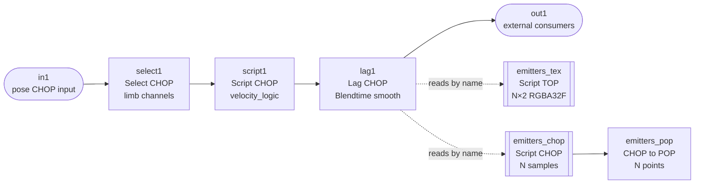
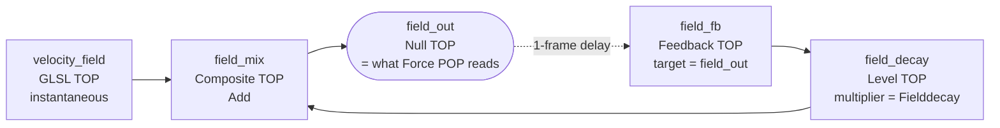
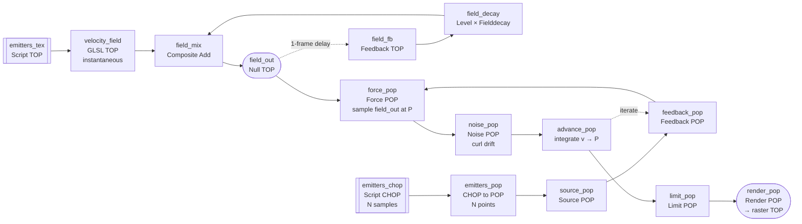
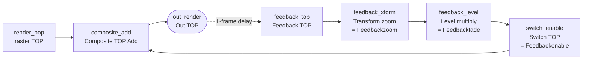

# velocity_controller — setup guide

Companion to `painting_controller`, same conventions (parent-pars-only, pure-Python
logic module, Lag CHOP does the smoothing, Select CHOP chooses landmarks upstream).
**Everything lives inside a single `velocity_controller` Base COMP** — sensing
chain and rendering chain are siblings inside the same COMP so every GLSL uniform,
Source POP rate, Feedback TOP fade, etc. can read its parameter locally as
`parent().par.*` with no custom COMP pointers. Targets TD **2025.30960+**.

## TL;DR of what this ships

A single `velocity_controller` Base COMP with two sub-chains:

- **Sensing** — reads 5 MediaPipe landmarks, emits per-limb
  `x/y/vx/vy/speed/accel/emit/burst/visible` plus `total_motion/total_burst/frame_dt`
  on `out1` (for any external consumer) AND feeds the renderer directly via the
  internal `lag1` CHOP.
- **Rendering** — reads `lag1` by channel name through two small Script ops
  (Script TOP + Script CHOP) that fan it out into a texture and a reshaped
  CHOP. The texture feeds a GLSL TOP velocity field; the CHOP feeds a
  stock CHOP-to-POP converter that seeds the POP spawn+advect chain. Final
  output is a TOP.

## Input contract (into the `velocity_controller` Base COMP)

One CHOP input carrying normalized MediaPipe pose channels. After the upstream
Select CHOP narrows to this experiment's landmarks, you should have, for each of
the five default landmarks, at minimum:

```
left_wrist:x   left_wrist:y    [left_wrist:visible]
right_wrist:x  right_wrist:y   [right_wrist:visible]
left_ankle:x   left_ankle:y    [left_ankle:visible]
right_ankle:x  right_ankle:y   [right_ankle:visible]
nose:x         nose:y          [nose:visible]
```

`:visible` is MediaPipe's 0..1 confidence score; anything below
`Visibilitythreshold` is treated as off-frame. If the channel isn't
present the landmark is assumed fully visible.

The exact landmark set is configurable via the `Landmarks` parent par (space or
comma separated); the Script CHOP rebuilds its state dict on change.

## Output contract (from the `velocity_controller` Base COMP)

Pre-Lag channels from the Script CHOP, in emission order:

Per landmark `<L>`:
- `<L>:x`, `<L>:y` — pass-through position (0..1)
- `<L>:vx`, `<L>:vy` — smoothed velocity (1/s in 0..1 space)
- `<L>:speed` — |v|
- `<L>:accel` — smoothed |a|
- `<L>:emit` — 0..1 emission rate (`speed / Speedscale`, clamped)
- `<L>:burst` — 0..1 burst envelope (`|a|` spike above threshold, decays)
- `<L>:visible` — 0 or 1

Globals:
- `total_motion` — sum of per-limb speed
- `total_burst` — sum of per-limb burst
- `frame_dt` — observed seconds between cooks (diagnostic; don't drive visuals with it)

Post-Lag (the Base COMP's actual output CHOP), these are all smoothed by a single
Lag CHOP whose `Lag 1` and `Lag 2` both reference `parent().par.Blendtime`. Keep
Blendtime short (0.05–0.15s) — we already smooth upstream, this is just to remove
frame-to-frame jitter for the renderer.

**Position-hold on dropout (hysteresis).** Confidence from MediaPipe
typically degrades *gradually* as a limb leaves the frame — position
becomes garbage several frames before confidence drops below any single
threshold. To handle that cleanly, the sensing side uses **two
thresholds**:

- `Visibilitythreshold` (default 0.5) — the *output gate*. Below this,
  `<L>:visible` emits 0 and emit/burst envelopes fade out.
- `Trustthreshold` (default 0.75) — the *commit threshold*. Only frames
  at or above this confidence update the cached "last good" position and
  run the velocity math.

That gives three behavioral zones on `:visible`:

| MediaPipe confidence | Zone | Output position | Output `visible` |
| --- | --- | --- | --- |
| ≥ Trustthreshold | Trusted | raw `x, y` | 1 |
| Visibilitythreshold..Trustthreshold | Marginal | last-good (frozen) | 1 |
| < Visibilitythreshold | Invisible | last-good (held) | 0 |

The key win is the marginal zone: the emitter stays on for spawning but
is pinned to the last genuinely-trusted position, so it doesn't slide
toward garbage during the confidence ramp-down. By the time `:visible`
goes to 0, position is already at the correct last-good — lag1 sees no
change in position, and the blob fades in place instead of sliding.

`Maxjump` is a secondary safeguard: within a *continuous* trusted stream,
any single-frame position jump larger than `Maxjump` UV units demotes the
frame to the marginal zone (output last-good, don't commit). The check
runs against the previous *frame's* position, not the cached last-good,
so after any dropout / marginal period it's naturally skipped —
re-acquisition always accepts the new position, even if the joint
reappears on the opposite side of the frame. (Without that, a joint that
leaves on the right and returns on the left would get stuck at the old
right-side cached position forever, because every re-acquisition frame
exceeds `Maxjump`.) Tune `Maxjump` against your expected fastest
legitimate motion: at 60 fps a very fast whip is ~0.05 UV/frame, so
0.2–0.3 is a safe ceiling. Set to 0 to disable.

`Settleframes` (default 5) is a third safeguard layered on top of
`Maxjump`. For the first N trusted frames after any dropout, the
`Maxjump` check is suspended. MediaPipe's first trusted frame on
re-acquisition often lands near the re-entry edge before locking onto the
real joint position a frame or two later — without the grace, that second
frame gets rejected as a teleport (it's > `Maxjump` from the edge `prev_x`)
and the blob would be stuck at the re-entry edge for a cook. During the
grace window we simply accept whatever MediaPipe sends; normal teleport
protection resumes once the tracker has had `Settleframes` cooks to lock
on. If you still see your blob briefly snap from the edge inward after
reappearance, raise `Trustthreshold` toward 0.85–0.9 — that's MediaPipe's
own edge-lock noise, which only a higher confidence threshold can filter
out at the source.

**NaN/Inf resilience.** MediaPipe occasionally emits non-finite position
or confidence values (first cook of an invisible landmark, tracker
restart, certain tox builds mid-dropout). The Script CHOP scrubs all
input channels with `math.isfinite` before the logic sees them, the logic
scrubs stored state on every cook, and `_emit` guards every outbound
channel. End result: NaN can never reach the Lag CHOP, and any
corruption that somehow does land in state heals on the next cook. If
you previously had to manually reset the Lag CHOP to clear stuck
accel/burst values, that should no longer happen.

**Tuning hierarchy if you still see a teleport:** raise `Trustthreshold`
first (0.8–0.9 is common for jittery MediaPipe output); then tighten
`Maxjump` toward 0.15. Don't raise `Visibilitythreshold` unless the joint
lingers as a fading blob for too long after it actually leaves frame —
that's what it's for.

## Inside the `velocity_controller` Base COMP

One COMP, three sub-chains: a sensing CHOP chain, a POP particle sim, and a
screen-space feedback loop on top. The diagrams below split them apart for
legibility; in the COMP itself they're all peers.

### Sensing chain + fan-out



Both Script ops pull from `op('lag1')` by channel name — no Select/Shuffle/Rename
between them and the Lag CHOP.

Text DATs (all peers of the ops they drive):
- `velocity_logic` — paste `velocity_logic.py`
- `velocity_script_chop` — paste `velocity_script_chop.py`, referenced by `script1`
- `install_velocity_params` — paste `install_velocity_params.py`, right-click ▸
  Run Script once. You can delete this DAT afterward.
- `emitters_tex_script` — paste `emitters_tex_script.py`, referenced by `emitters_tex`
- `emitters_chop_script` — paste `emitters_chop_script.py`, referenced by `emitters_chop`

Sensing chain wiring:
- `select1` pattern: `left_wrist:* right_wrist:* left_ankle:* right_ankle:* nose:*`
- `script1` Callbacks DAT: `velocity_script_chop`
- `lag1` Lag 1 / Lag 2: both expression `parent().par.Blendtime`
- `out1` just dangles off `lag1` for external consumers (the renderer reads
  `lag1` directly by name, so `out1` is optional).

Parent pars installed onto two pages:
- **Sensing**: `Landmarks`, `Visibilitythreshold`, `Trustthreshold`, `Velocitysmooth`,
  `Accelsmooth`, `Speedscale`, `Accelthreshold`, `Accelscale`, `Burstdecay`,
  `Maxjump`, `Settleframes`, `Blendtime`.
- **Renderer**: `Spawnrate`, `Burstgain`, `Fieldradius`, `Fieldforce`,
  `Fielddecay`, `Curlgain`, `Curlscale`, `Lifemin`, `Lifemax`, `Feedbackenable`,
  `Feedbackfade`, `Feedbackzoom`.

The page split is purely organisational — both pages live on the same COMP, and
every renderer op reads its pars via `parent().par.*` because `parent()` inside
any op is `velocity_controller`. Sensing tuning doesn't disturb rendering and
vice versa, even though they share a COMP.

## Renderer sub-chain (inside `velocity_controller`)

The render side reads from the sensing-side `lag1` CHOP via two small Python
operators. No Shuffle/Rename/Select fan-out — both scripts look up channels by
name (`left_wrist:x`, etc.) so they don't care about channel order.

### 1. `emitters_tex` — Script TOP

Feeds the velocity-field shader. Produces an `N × 2` RGBA32F texture:

- Row 0: `(x, y, vx, vy)` per landmark
- Row 1: `(emit, burst, visible, speed)` per landmark

Setup:

1. Inside `velocity_controller`, create a **Text DAT** named
   `emitters_tex_script`, paste `emitters_tex_script.py`.
2. Create a **Script TOP** named `emitters_tex`. No inputs — it reads
   `op('lag1')` by name from inside its callback.
3. Set its Callbacks DAT to `emitters_tex_script`.
4. Set Output Resolution to Custom, e.g. `5 × 2` (matches default landmark
   count). The callback also calls `copyNumpyArray` with the correct shape,
   so TD resizes automatically on cook — but setting it explicitly avoids a
   one-frame black flash on startup.

### 2. `velocity_field` — GLSL TOP (+ external persistence chain)

Samples `emitters_tex`, splats gaussians, outputs the **instantaneous**
advection field. Persistence (force trails lingering in the air) lives
outside the shader so it compiles with a single input and is tuneable
without recompile.

**GLSL TOP itself:**

- **Pixel Shader**: `velocity_field.frag` (load via the GLSL TOP's `Pixel
  Shader` par pointing at the file on disk, or paste into a Text DAT and
  reference that).
- **Resolution**: `256 × 256`, Format `RGBA 16-bit float`.
- **Input 0**: `emitters_tex`. **No other inputs** — the shader declares
  `sTD2DInputs[0]` only; wiring an input 1 is neither needed nor valid.
- **Vectors 1 uniforms** (all expressions, reading `parent().par.*`):

| Uniform | Expression |
| --- | --- |
| `uNumEmitters` | `len(parent().par.Landmarks.eval().replace(',', ' ').split())` |
| `uRadius` | `parent().par.Fieldradius` |
| `uForceGain` | `parent().par.Fieldforce` |
| `uBurstGain` | `parent().par.Burstgain` |

**External persistence chain** (follows the GLSL TOP, output of the chain is
what the Force POP samples):



`field_decay`'s RGB Multiplier = `parent().par.Fielddecay`. Same knob, same
semantics as before — at 0 the field snaps every frame, at 0.9 it trails for
about a second. The Force POP points at `field_out` (not `velocity_field`)
so it reads the persistent field, not the instantaneous one.

### 3. `emitters_chop` (Script CHOP) → `emitters_pop` (CHOP to POP)

Two-op chain. TD has no Script POP, so we stage the work in CHOP-land (where
Script CHOP has always been reliable) and hand off to a native CHOP-to-POP
converter for the final conversion. Script CHOP reshapes `lag1`'s
1-sample-many-channels output into an N-sample-few-channels shape with
attribute-style channel names; CHOP-to-POP then reads those channels into
the vec3 / scalar point attributes the Source POP needs.

**`emitters_chop` — Script CHOP:**

- Text DAT `emitters_chop_script`, paste `emitters_chop_script.py`.
- Create a **Script CHOP** named `emitters_chop`, Callbacks DAT =
  `emitters_chop_script`. No inputs — it reads `op('lag1')` by name from
  inside the callback.

Output CHOP has N samples and these channels (per landmark, one sample
each):

| Channel | Meaning |
| --- | --- |
| `P[0]`, `P[1]`, `P[2]` | Point position (z = 0) |
| `v[0]`, `v[1]`, `v[2]` | Initial velocity handed to new particles (z = 0) |
| `w` | Spawn weight = `(emit + Burstgain * burst) * visible` |
| `id` | Landmark index, for per-limb color |

Drop a Trail CHOP on `emitters_chop` while debugging — you should see 5
samples, each tracking the matching landmark's live position/velocity.

**`emitters_pop` — CHOP to POP:**

- Create a **CHOP to POP** op named `emitters_pop`.
- Its CHOP input: `emitters_chop`.
- Default conversion rules are what we want:
    - Channels named `P[0]`, `P[1]`, `P[2]` coalesce into a vec3 `P`
      point attribute (the built-in position).
    - Channels named `v[0]`, `v[1]`, `v[2]` coalesce into a vec3 `v`
      attribute.
    - Scalars `w` and `id` become per-point float attributes.
- If your CHOP-to-POP exposes a "Promote to Position" toggle or
  "Channel-to-Attribute" override, leave them default — the bracket naming
  is the de facto convention and TD auto-detects it.

That's it. The Source POP downstream takes `emitters_pop` as its input
points exactly as before — none of the Source POP / Feedback POP / Force
POP / etc. settings change.

### 4. POP spawn + advect chain

All POPs, all inside `velocity_controller`:



Two inputs into the sim: the **point stream** (`emitters_pop` → `source_pop`)
seeds new particles at the right places, and the **force field**
(`emitters_tex` → `velocity_field` → `force_pop`) pushes existing particles
around once they're alive.

Per-node setup:

- **`source_pop`** (Source POP)
    - Spawn From: `Input Points`
    - Rate Mode: `Per-Second (Weighted)`
    - Weight Attribute: `w`
    - Total Rate: `parent().par.Spawnrate`
    - Initial Velocity: `From Input Attribute`, attribute `v`
    - Life Min/Max: `parent().par.Lifemin` / `parent().par.Lifemax`

- **`force_pop`** (Force POP) — inside the feedback loop
    - Field Source: `From TOP`
    - TOP: `field_out` (the Null TOP at the end of the persistence chain, NOT
      the raw `velocity_field` — you want the persistent field the Level TOP
      is fading)
    - Sample Mode: `At Position` (uses `P.xy` as UV)
    - Gain: `1.0`

- **`noise_pop`** (Noise POP) — inside the feedback loop
    - Mode: `Curl`
    - Gain: `parent().par.Curlgain`
    - Period: `parent().par.Curlscale`

- **`advance_pop`** (Advance POP) — inside the feedback loop
    - Integrates velocity into `P` each frame. Default settings are fine.

- **`feedback_pop`** (Feedback POP)
    - Target: `advance_pop` (the output of the loop body)
    - This is what makes the chain iterative across frames.

- **`limit_pop`** (Limit POP)
    - Kill particles whose `P.x` or `P.y` fall outside `[0, 1]`.

- **`render_pop`** (Render POP)
    - Style: `Point` (or `Sprite` for softer blobs).
    - Size: 2–4 px (scale up if the scene feels sparse).
    - Color: gradient on age, or bind `id` attribute to a LUT for per-limb
      color signatures.

> **Why `noise_pop` *and* `force_pop`?** Force POP sampled from the velocity
> field gives directed motion from limb movement. Noise POP (curl mode) gives
> particles somewhere to drift when the performer is still — otherwise the
> visual freezes on every pause. Default curl gain is low (0.15) so limbs
> dominate when someone's actually moving.

### 5. Screen-space feedback smear

On top of `render_pop`'s TOP output:



The Switch TOP lets you kill the whole feedback branch with a single toggle
(`parent().par.Feedbackenable`) without detaching cables.

Keep `Feedbackfade` around 0.9–0.95 and `Feedbackzoom` barely above 1.0
(1.002–1.01). That's the optical-flow smear look: recent particle positions
persist and slowly dim/drift, which reads as velocity trails *behind* the
particles on top of the directed motion they already have.

## Resolution & aspect

Three resolutions in the pipeline, each serving a different role — they do
NOT all need to match each other.

| Op | Resolution | Role | Aspect considerations |
| --- | --- | --- | --- |
| `emitters_tex` | `N × 2` (e.g. `5 × 2`) | Lookup table sampled by the shader. Not displayed. | None — aspect is meaningless for a texture you index by explicit UV. |
| `velocity_field` + persistence chain | `256 × 256` default | Sampling fidelity of the 2D force field. Both emitters and particles live in 0..1 UV, so this is about how finely gaussians splat, not about matching a viewport. | Aspect doesn't matter. Drop to `128 × 128` if GPU-bound; go to `512 × 512` for finer splats from tight kernels. Above that is wasted — a sigma-0.12 gaussian doesn't carry information past ~512. |
| `render_pop` output → `out_render` | Match your display target (e.g. `1920 × 1080`) | What actually hits the projector / downstream stack. | Match your **display** aspect. Use an orthographic camera on the Render POP with its view box covering `(0..1, 0..1)` so particle `P.xy` lands correctly at all viewport aspects. |

**Common pitfall — source ≠ display aspect.** MediaPipe emits landmarks in its
**source-image** 0..1 space. If your camera is 16:9 but your projection is
4:3 (or vice versa), particle positions will stretch visibly. `painting_controller`
solves this with `Sourceaspect` / `Viewaspect` pars plus letterbox logic inside
`painting_logic.wrists_in_bounds`. This controller ships without that, because
for free-floating particles the stretch is usually unnoticeable. If your
installation needs it, either:

- Add a `Math CHOP` / `Stretch CHOP` upstream of `in1` that remaps landmark
  `x, y` from source aspect into viewport aspect, or
- Port the `_remap_for_aspect()` helper from `painting_logic.py` into
  `velocity_logic.py` and apply it in `update_landmark()`.

**Subtle shader aspect detail.** Inside `velocity_field.frag` the gaussian is
`exp(-|d|² / 2r²)` where `d` is in raw UV. That's round in UV space, which
means slightly elliptical on a non-square render. Rarely visible at the
default `Fieldradius`; only worth aspect-correcting if you see it as a flaw.

## Quick tuning checklist

1. **Hands not emitting enough particles at gentle motion.** Drop `Speedscale`
   (smaller → full emit at lower speed). Or raise `Spawnrate`.
2. **Bursts not popping on whips.** Drop `Accelthreshold` until the burst
   channel pulses visibly on a Trail CHOP; tune `Accelscale` so a hard whip
   reaches 1.0 but gentle waves stay below 0.3.
3. **Particles freeze when performer stops.** Raise `Curlgain` so idle noise
   is visible.
4. **Field feels laggy / pushes particles off-camera.** Lower `Fieldforce`
   and/or `Fielddecay`.
5. **Screen is a solid white after a few seconds.** `Feedbackfade` too high —
   pull it down toward 0.88.
6. **Particles spawn in the corner, not at the limbs.** The `P` attribute
   on `emitters_pop` is stuck at origin. Drop a Trail CHOP on `emitters_chop`
   first — you should see `P[0]`, `P[1]` tracking live. If those look right
   but the POP is still at origin, the issue is in the CHOP-to-POP: check
   that it's actually recognising the `P[n]` naming (some builds need
   "Channel Scope" set to `*` or "Name Match" mode enabled to pick up
   bracketed channels).
7. **`emitters_tex` is all zero.** Open its Viewer — pixels 0..4 on row 0
   should have non-zero R/G. If the Script TOP is erroring, check its
   textport: most likely `op('lag1')` returned None because the sensing chain
   isn't wired up yet, or a landmark name in `Landmarks` doesn't match the
   upstream channels (watch for singular/plural, e.g. `left_index` vs
   `left_index_tip`).
8. **Visibility threshold does nothing — every joint is always "visible".**
   The Script CHOP reads `<L>:visible` (blankensmithing tox convention,
   0..1 confidence). Drop a Trail CHOP on whatever's feeding `in1` and
   confirm those channels are present and actually varying. If your upstream
   tox uses a different suffix, change `f'{lm}:visible'` in
   `velocity_script_chop.py` to match.

## Forking for another experiment

Same playbook as `painting_controller`:

- Duplicate the `velocity_controller` Base COMP, rename it.
- If the new experiment needs different landmarks, edit `parent().par.Landmarks`.
  The Script CHOP rebuilds its state dict automatically. Both `emitters_tex`
  and `emitters_pop` pick up the new landmark list on the next cook — no
  wiring changes needed.
- If it needs more than velocity (e.g., relative distance between limbs,
  vertical position bands), add a helper to `velocity_logic.py` that returns
  extra fields, extend `PER_LANDMARK_CHANS` or `GLOBAL_CHANS`, and the Script
  CHOP will emit them. If the new fields should reach the renderer, also
  extend `emitters_tex_script.py` to pack them into unused channels of the
  texture (B/A of row 1 are free after `visible` and `speed` if you want to
  reuse them).
- If the visual needs to change substantially, edit the POP chain in place —
  or, if you expect to swap whole renderers frequently, expose the render
  sub-chain as a child Base COMP inside `velocity_controller` so you can
  replace the child without rewiring the sensing side.

Portable bits to lift: the state-on-COMP-via-store/fetch pattern for per-cook
memory; the `Landmarks` parent-par convention; the idempotent page installer;
the "Script TOP + Script CHOP read the same CHOP by name" idiom for turning
sparse semantic channels into dense render inputs without Shuffle CHOPs.
